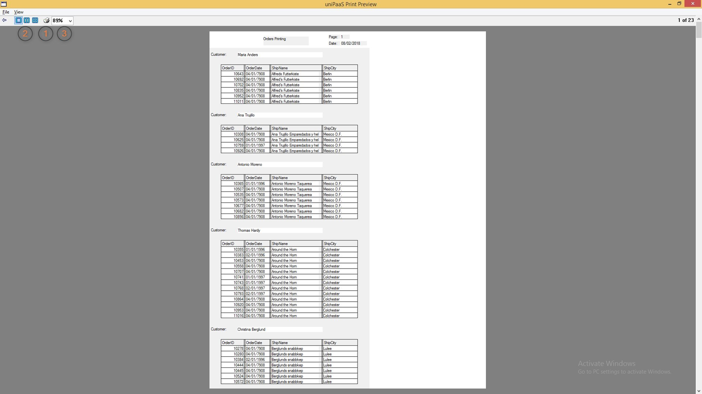
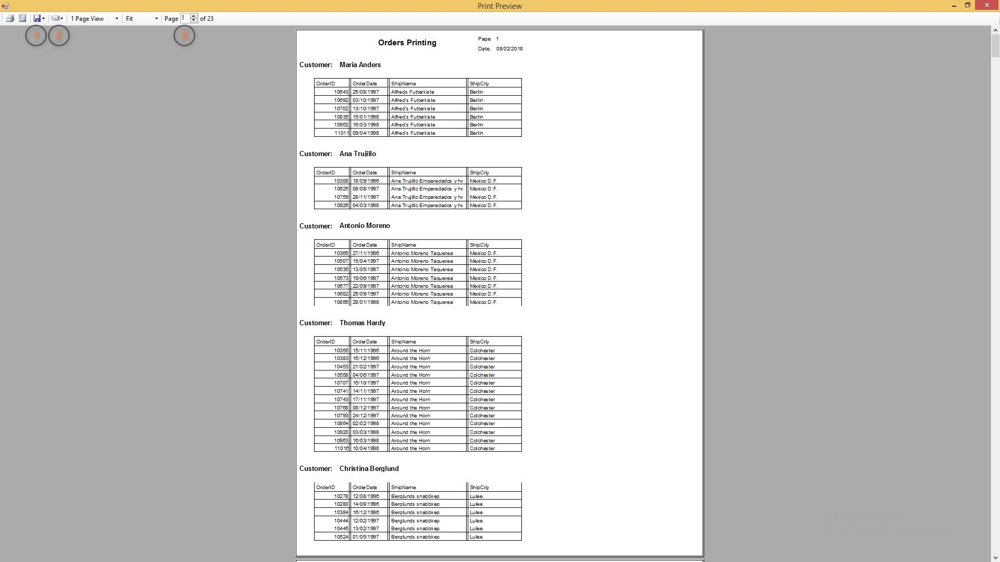

keywords: report, print, preview

# Firefly's print preview capabilities

This is the Magic print preview screen:  

The options available for the user are:
1. Print
2. Change the number of pages per screen
3. Change the deault zoom percentage

This is how the Firefly's print preview screen looks like:

As you can see, in addition to the options available in Magic, there are some additional functions availble:
1. Saving the report as an external file (either a tiff or pdf).
2. Send as an email attachment (either a tiff or pdf).
3. Jump straight to a specific page by specifying its number.

One more important difference is the quality of the view when zooming.  
For example, this is how the Magic print preview screen looks like when zooming in 500%:

And this is how it looks in Firefly:

