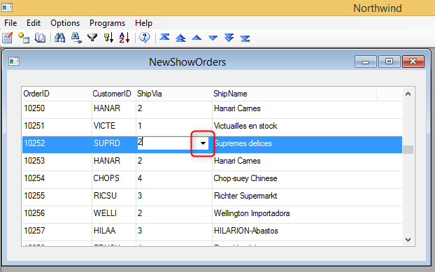
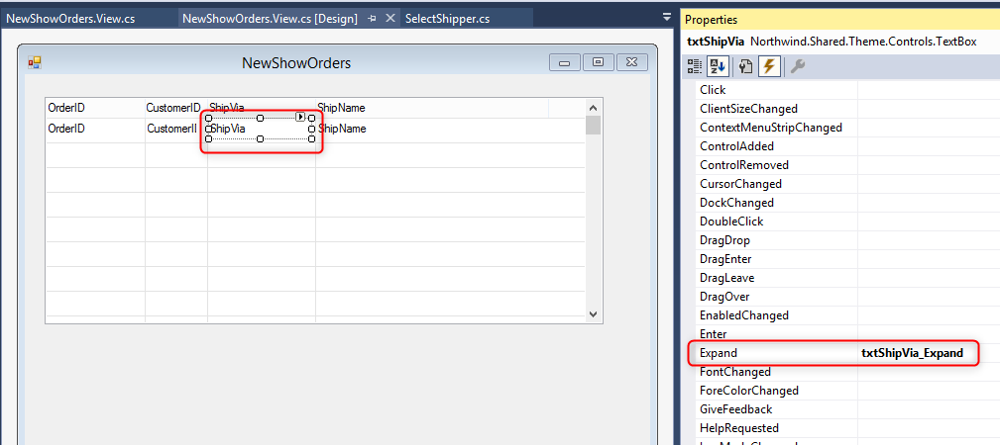

keywords: Expand button, zoom

## TextBox ShowExpandButton property

---

Expand button is an indicator for the user that by pressing F5 or by DbClick on the control a new window will be opened.  
This is a much more visible indicator than the ‘Zoom’ text on the status bar

The Expand button is visible when the control’s property ‘ShowExpandButton’ is set to True and if an Expand event is defined for the control.  

For example, in a program that displays orders the developer would like to allow the user to zoom from the Ship via field to select a shipper.

The ShipVia field will have an Expand event defined.

The ShowExpandButton property will be set to True

