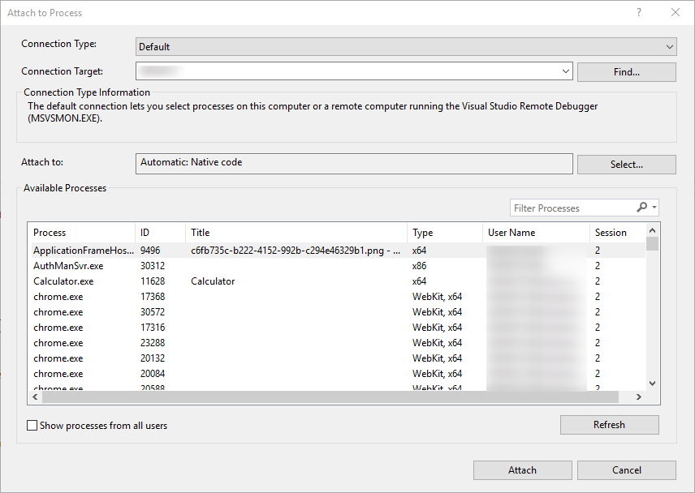
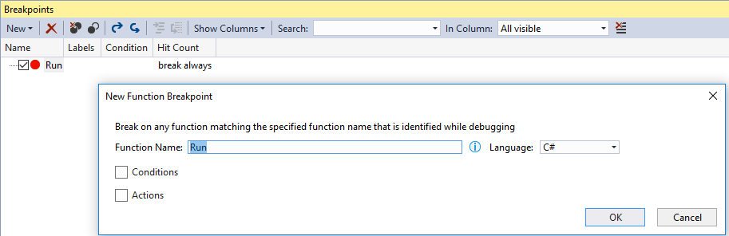
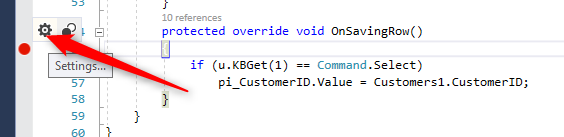
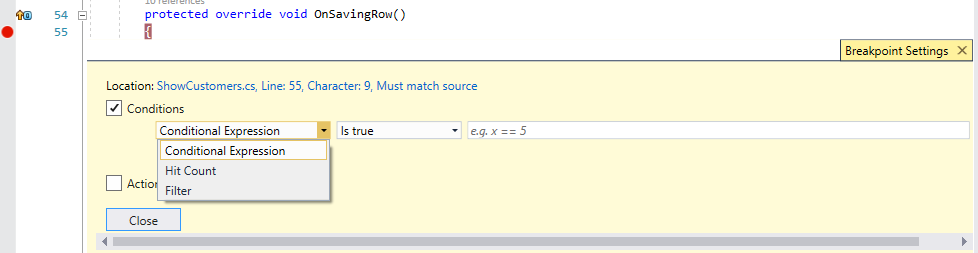

> "*Everyone know that __**debugging is twice as hard**__ as writing a program in the first place.
> So if you're as clever as you can be when you write it, how will you ever debug it?*"
> - **Brian Kernighan**, Computer Scientist

## Introduction ##
Developers spends more time maintaining and debugging the applications than writing it.
Visual Studio provides a lot of powerful tools to debug our application. Some of tools are hidden and are less familiar by many .NET developers.
This article reveals some of the hidden features of Visual Studio and introduces advanced techniques to help you master Visual Studio debugging.

### Start Debugging ###

Usually, you start a debugging session by pressing F5 (Debug > Start Debugging), or by clicking the green arrow to start the application with the debugger attached.

Once the debugger is attached, you can use the application to navigate to any program and press <kbd>Shift + F12</kbd> to suspend execution and go to the current running program. This option works only in applications that were migrated by Firelfy.

Other ways to start the application with the debugger attached are F10, F11, or by right clicking a code line and using Run to Cursor (or pressing <kbd>Ctrl + F10</kbd>).

If you start the application without debugging you can still attach the debugger to a running process by pressing <kbd>Ctrl+Alt+P</kbd> (Debug > Attach to Process...) and select the process of the applicaiton from the list.

### Breakpoints ###
You can set breakpoint on any code line by pressing F9, when you want to suspend the execution. 
In case you want to disable a breakpoint but keep the location of it, press <kbd>Ctrl + F9</kbd>.

#### Setting a breakpoint from the Breakpoints window ####
You can also set a new breakpoint from the Breakpoints window (Debug > Windows > Breakpoints or <kbd>Ctrl + Alt + B</kbd>).
This window allows you to manage breakpoints and see all the breakpoints you have set in your application.

One of the hidden secrets of Visual Studio is the ability to create a new Function Breakpoint from this window.
A Function breakpoint is connection to a method name. For example, if you create a new function breakpoint providing "Run" as the function name, the application will suspend execution on any call to a method name Run.

This screen gives you options to add conditions and actions to each breakpoint.

#### Breakpoint conditions ####

You can control when a breakpoint suspend execution by settings conditions.
Hover over the breakpoint and click on the settings button to open the Breakpoints Settings window.

When you check the Conditions box, the window expands allowing you to set conditions for the breakpoint.
You have a few kinds of conditions. Expression that will be calculated and break if it is true, or when it is changed.
You may also add a hit count condition, which is useful to stop inside a loop on a specific iteration.

#### Breakpoint actions ####

Another hidden feature of Visual Studio is Tracepoints. A tracepoint is a breakpoint that prints a message to the Output window.

In the Breakpoint Settings window, check the Actions box. You can print any string and also use special keywords in the message such as $CALLER, $CALLSTACK, $FUNCTION and more. 
See https://docs.microsoft.com/en-us/visualstudio/debugger/using-breakpoints for more information.

### Debugging Navigation ###
When you start a debugging session, you can use F10 to step over a line of code or F11 in case you need to step into a method code.  

#### Run to Cursor ####
Another option is to put the mouse cursor on a specific line and right click that location to select "Run to Cursor". This works as if you create a one time breakpoint at this line, so the code will executes and stop at the line your mouse cursor is pointing on.  

#### Step into Specific ####
Some code lines are compound calls to different methods. Using F11 will step into each call. 
If you only want to step into a specific method, right click and select "Step into Specific". This allows you to select the method you want to step into.  

Restart application
Set next Statement 

### Debug Windows ###

### Controling the Debugger by Code ###

