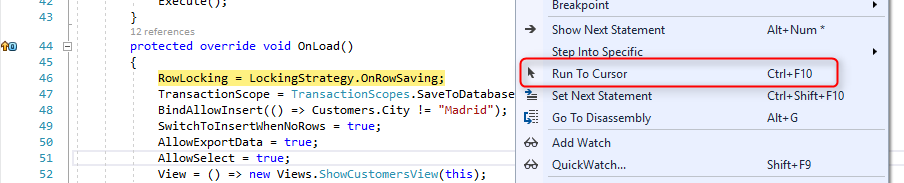
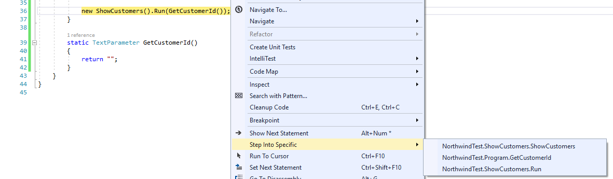
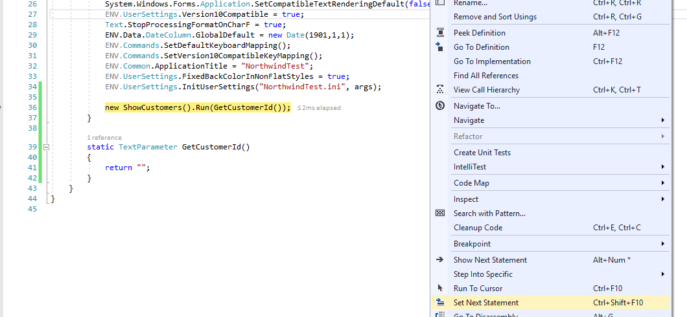
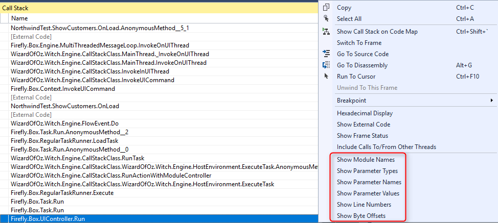
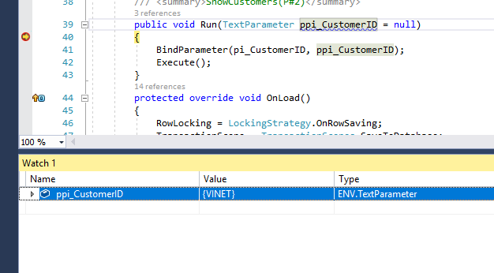
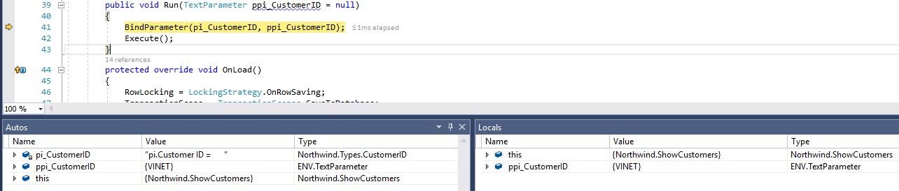

> "*Everyone know that __**debugging is twice as hard**__ as writing a program in the first place.
> So if you're as clever as you can be when you write it, how will you ever debug it?*"
> - **Brian Kernighan**, Computer Scientist

## Introduction ##
Developers spends more time maintaining and debugging the applications than writing it.
Visual Studio provides a lot of powerful tools to debug our application. Some of tools are hidden and are less familiar by many .NET developers.
This article reveals some of the hidden features of Visual Studio and introduces advanced techniques to help you master Visual Studio debugging.

### Start Debugging ###

Usually, you start a debugging session by pressing F5 (Debug > Start Debugging), or by clicking the green arrow to start the application with the debugger attached.

Once the debugger is attached, you can use the application to navigate to any program and press <kbd>Shift + F12</kbd> to suspend execution and go to the current running program. This option works only in applications that were migrated by Firelfy.

Other ways to start the application with the debugger attached are F10, F11, or by right clicking a code line and using Run to Cursor (or pressing <kbd>Ctrl + F10</kbd>).

If you start the application without debugging you can still attach the debugger to a running process by pressing <kbd>Ctrl+Alt+P</kbd> (Debug > Attach to Process...) and select the process of the applicaiton from the list.

### Breakpoints ###
You can set breakpoint on any code line by pressing F9, when you want to suspend the execution. 
In case you want to disable a breakpoint but keep the location of it, press <kbd>Ctrl + F9</kbd>.

#### Setting a breakpoint from the Breakpoints window ####
You can also set a new breakpoint from the Breakpoints window (Debug > Windows > Breakpoints or <kbd>Ctrl + Alt + B</kbd>).
This window allows you to manage breakpoints and see all the breakpoints you have set in your application.

One of the hidden secrets of Visual Studio is the ability to create a new Function Breakpoint from this window.
A Function breakpoint is connection to a method name. For example, if you create a new function breakpoint providing "Run" as the function name, the application will suspend execution on any call to a method name Run.

This screen gives you options to add conditions and actions to each breakpoint.

#### Breakpoint conditions ####

You can control when a breakpoint suspend execution by settings conditions.
Hover over the breakpoint and click on the settings button to open the Breakpoints Settings window.

When you check the Conditions box, the window expands allowing you to set conditions for the breakpoint.
You have a few kinds of conditions. Expression that will be calculated and break if it is true, or when it is changed.
You may also add a hit count condition, which is useful to stop inside a loop on a specific iteration.

#### Breakpoint actions ####

Another hidden feature of Visual Studio is Tracepoints. A tracepoint is a breakpoint that prints a message to the Output window.

In the Breakpoint Settings window, check the Actions box. You can print any string and also use special keywords in the message such as $CALLER, $CALLSTACK, $FUNCTION and more. 
See https://docs.microsoft.com/en-us/visualstudio/debugger/using-breakpoints for more information.

### Debugging Navigation ###
#### Run to Cursor ####
When you debug the application, you can use F10 to step over the code line by line or F11 to step into the code of the method being called.
Sometime you want to skip a part of the code and break on a specific line. In this case, set the cursor at the line of code you wish to stop on, right click and select **Run to Cursor** or press Ctrl+F10

#### Step into Specific ####
When you have a conplex code line that has more than one method call in it, you can select the specific method you want to step into.  
Right click the line of code and select **Step into Specific**

#### Set next Statement ####
This option allow you to continue the debugging from any statement you want, even going back a few lines and execute them again. Notice that this will not undo the last execution but will allow you to rexecute the code again.  
Right click the line you want to execute next and select **Set Next Statement** or press Ctrl+Shift+F10

### Debug Windows ###
#### Call Stack ####
The Call Stack window display a list of methods calls that leads to the current program. It is a good way to examine and understadnd the execution flow of the application.  
Double clicking on any of the lines in the call stack will jump to the code of that method.
By default, the call stack displays a lot of information, which are usaully not needed, so it is recommended to right click any where and uncheck all the "Show..." entries at the bottom of the context menu.

#### Watch ####
While debugging, you can use the **Watch** window (Debug > Windows > Watch (1, 2, 3, 4)) to watch variables and expressoins values. 
Inside the watch window you can also change the value of any variable and continue debugging using the new value. This is usefull when you need to get inside an if statement or pass througe some validaton code.

#### Autos and Locals ####
The **Autos** window (Debug > Windows > Autos) and the **Local** window (Debig > Windows > Locals) are quite useful when you want to see variable values while you are debugging.
The **Locals** windows displays the variables that are defined in the local scope, which are the variable that are in use at the current line of code or variable that are part of the current method.
The **Autos** window displays variables used around the current line and try to guess which variables are more relavent for this specific debug session.
These windows somtimes save the need to add variable to the **Watch** window manually.

