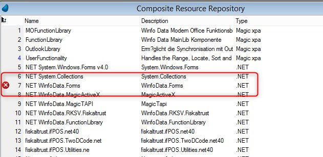
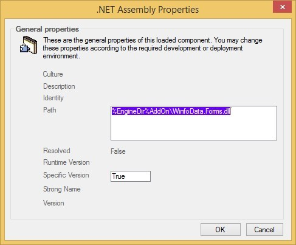
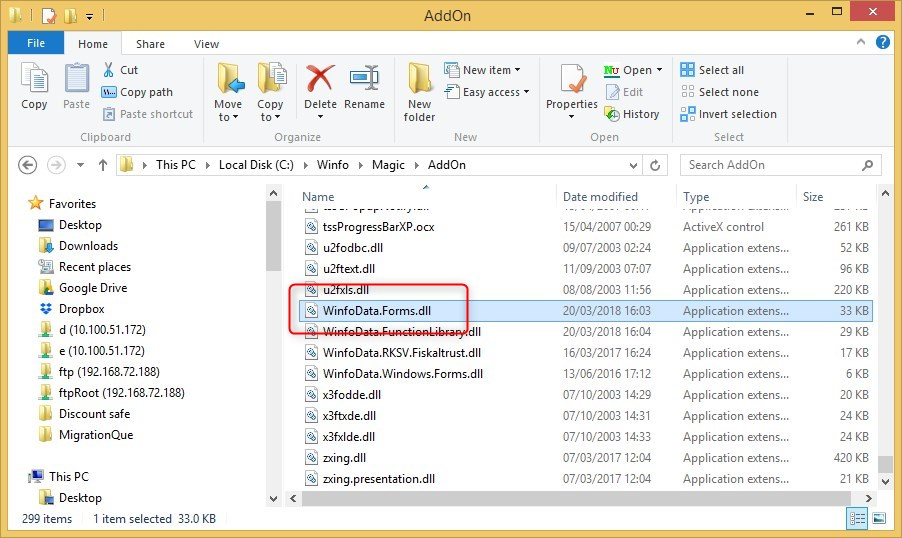
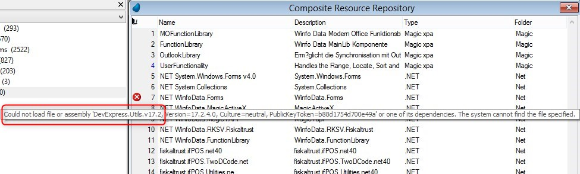

# Where does XPA look for external .Net dlls

Adding a .Net CRR in XPA is done by creating a new entry in the CRR, specifiying that the type is .Net and browse for the dll.

However, as you can see here, althought the dll exists in the specified folder, Magic still shows an error:  


This is the location of the dll:  
  

And this is the dll in the folder:  
  

This stems from the fact that the loaded dll is depending on another dll that Magic cannot find:  

 
In order to indicate to Magic where to look for other dlls, you need to edit the `MgxpaStudio.exe.config` file
(in the Magic folder).  
Look for the `probing` element and add the required path in the `privatePath` attribute. For example:
```csdiff
-<probing privatePath="TaskEditor\Application"/>
+<probing privatePath="TaskEditor\Application;AddOn"/>
```

This is relevant to us, since you will probably need to use the `AddDotnetReference` project setting. For example:
```csdiff
+ps.AddDotnetReference("DevExpress.Utils.v17.2");
```

