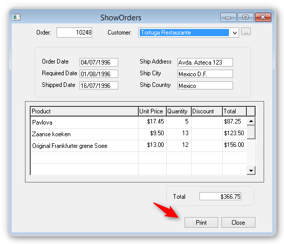
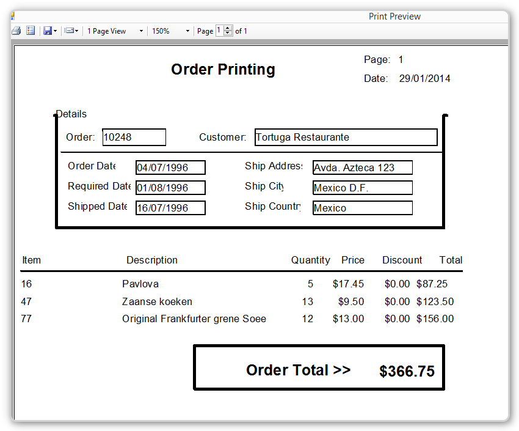
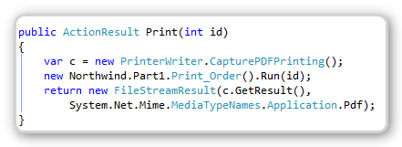
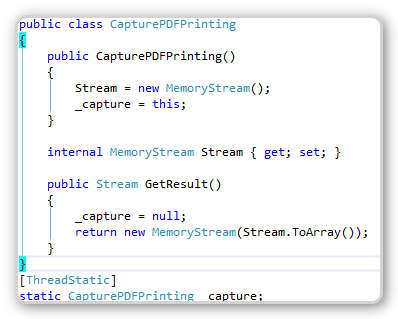

# Reusing Migrated Reports on the Web

I’m working now on new and interesting ways to reuse existing/migrated code in web projects.

This article is a part of a series of articles about reusing code from a migrated project in a web project.

To configure and setup an MVC application that reuses migrated code, see Setting up an MVC project that reuses migrated code – this article

Next I recommend you read the following articles in the following order:

1. Creating my first MVC page
2. Using POCO Objects Based on Migrated Entities
3. Poco Creator–automatically create poco object based on entities, (T4 Templates)
4. Poco Creator, next step–extending the generated objects
5. Reusing Migrated Reports on the Web – this article
This time, my goal was to reuse reports that I already had in my application.

For example, in the Northwind application, there is a print button, that prints the current Order.  

When the Print button is clicked, it’ll open the Print Preview screen and show the following report.  

I want to reuse that report on the web.

To do that, I created a class that alters the existing PrinterWriter, so that when it’s set, it re-routs all printings to an in memory PDF printer.

I’ll show its implementation in a second, but first let’s see how to use it.

I’m using MVC, so all I needed to do is to add a “Print” method to my MVCController:  

The first line,instantiates a new instance of the CapturePDFPrinting class (temporary name), which captures all printings and converts them into a PDF.

Then I called the existing (Migrated) class that prints the report. Note that I didn’t have to alter it in any way. Once it’s done, I’m returning an MVC.FileStreamResult with content type PDF.

This is the result in the browser:  

That’s it.

For those of you who want to use it, these classes are included as part of a migration project, with the Northwind code sample or with your migrated code.

Now for the under the hood implementation, only read this if you really care about wiring:

First I needed to change the existing PDF printing to support printing to a Stream and not only to a File.

So I changed the _fileName member to be a factory that returns a Stream:  

Its usage now uses the StreamFactory instead of creating the stream on the spot:

I have changed the constructor to receive a StreamFactory and to have an overload for the original implementation.

Then I have added the CapturePrinting class, and a ThreadStatic member to hold it when it’s used:  

And finally I altered the CreateAlternativePrintJob class to use the capture class when it’s not null:  

Now, only for the current thread, at the current time— every printing will print to an in-memory PDF printer, in which its results are returned immediately to the browser.