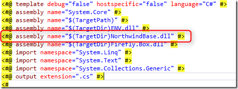
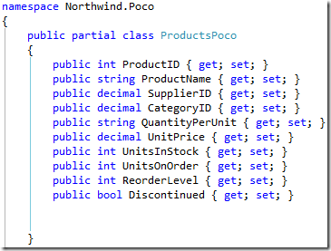
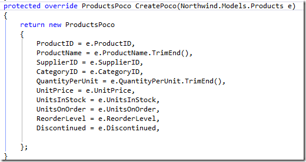
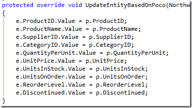
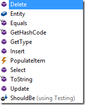

# POCO Creator – V0.1

**Disclaimer – this is a sample code, it’s here to give you indication of what can be done, not to do everything. It is intended as a starting point for your future development. It has bugs and room for improvement**

Now that we have seen what can be done with code generation, let’s have it create our entities for us , with add the member and a provider class.

Again, we’ll start with the setup, that may be a bit annoying, but after we do it once we can use it, again and again by adding just one line of code.

We’ll start by adding the “PocoCreator” class to ENV.Utilities, you can find the source for that class, at the end of this article.

Then we’ll build ENV, and our Northwind.Poco project (trust me, it’s important).

We’ll add a new TextTemplate to the Northwind.Poco project and call it “CreatePocos”, and place in it the Content of the CreatePoco.tt file that is detailed at the end of this article.

Save, build and see that everything works.

Now we need to let the TextTemplate know about the NorthwindBase assembly (where all my Entities are), so we’ll add the following line:  

Now let’s add the following line inside, instructing the creator to create a PocoObject for the Products Entity:  

Once we save the file, the “CreatePoco.cs” file will include the following two classes:

1. The ProductsPoco  

2. The “ProductsPocoProvider” class:  

3. That class also has all the code required to load data into the POCO:  

4. And all the code to save the data back to the Entity:  

The PocoProvider class has several useful methods that can be used to load and save data from to the database:  

