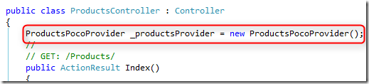
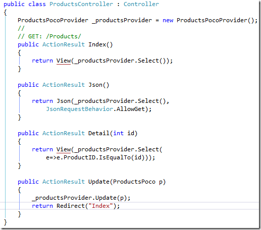

# Using the PocoProvider in an MVC controller

That’s easy – let’s create a “Products” controller, like before, and add to it the ProductsProvider class:  

Now just as before in the CustomersController detailed in the previous article we’ll have the following methods:  

All of this code was generated using the two files attached at the end of this article. I encourage you to dive into them, understand the implementation and suggest new and exciting ways to use them.

For example, in the current implementation, you can choose different names, make the classes partial or abstract and extend them – and some more features we are playing with.

In the following articles I’ll write about how to modify these classes a bit adding some more logic to them.

Next I recommend that you read the post – Poco Creator, next step–extending the generated objects