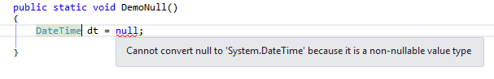
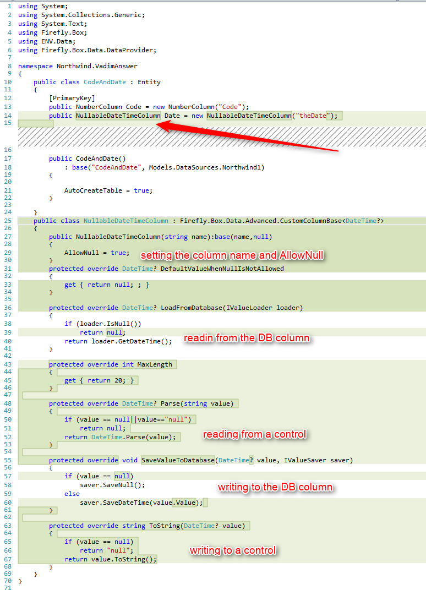

# Using DateTime columns with Null

Using a DateTime column in an SQL table is quite common.
Using it in .Net has one limitation – DateTime cannot be null as it is a struct and not a class.

You can read more about it [here](https://msdn.microsoft.com/en-us/library/1t3y8s4s.aspx)

First, lets define a table with a DateTime column:

In case you had a Time column coupled to a Date column in the original code, it will look like this in the migrated code:

There are better solutions than this.

Use an alternative value

This way you can determine what would be the value shown to the user / saved to the DB when a Null value is used.

This solution involves:

* Using the Firefly.Box.Date.DateTimeColumn – allowing you to have one column with both the date and time.
* Determining what would be the Null value when reading from the DB columns / writing to the DB column.
* Creating your own storage and using it in the column.  

The result would look like this:

Use a custom column

This way you can create your own column, based on your preferences.

This solution involves:

* Using a tweaked DateTime struct called “DateTime? ” which allows Null
* Creating a new column and implementing all the methods and properties of the inheriting class.

The result would look like this:

What to do when using a custom column

The Firefly entity generator recognizes the common column types and not a custom one. So when trying to generate the table such a column will be ignored.  
In order to correlate a custom column type with a common one, you need to:

* Inherit the interface ENV.Utilities.SqlScriptGenerator.IColumn
* Implementing both DbType and DbDefault attributes
* In its implementation set the DbType to a common one.
 
The result would look like this:

Keep in mind that you can keep this new column type in the Shared project or even in the ENV project for reuse.