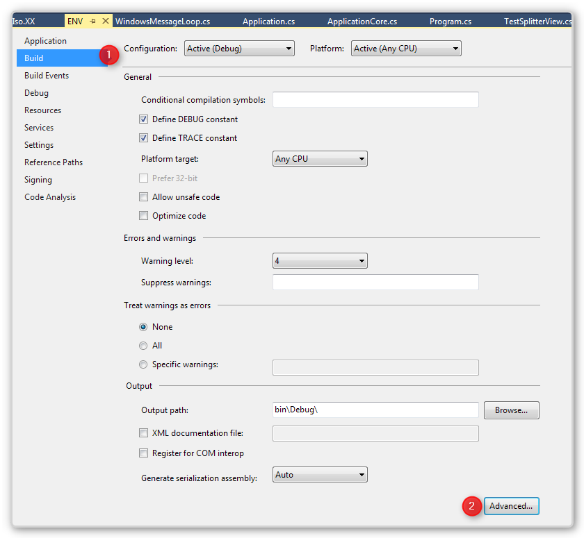
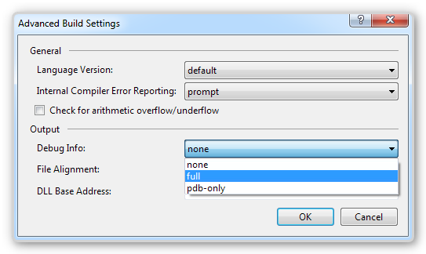

# Debugging ENV

When customers were debugging migrated code, we found that the code of the ENV library was sometimes cluttering. It gave you more info than you needed and could handle at the time. Also when stopping at  a breakpoint, Visual Studio displays the Abstract class instead of the actual code that runs.

Initially we instructed developers to compile ENV in release. The problem with that solution is that it took valuable training time, and we found that people often forget that and stay with the debug information of ENV, which most of the time confused them.

So we decided that by default, ENV will not contain debug information.

This improves the debug experience of migrated code for 99 percent of the time.

For the remaining one percent, you can reactive debug information for ENV using the following steps:

1. Open ENV’s Project Properties
2. Go to the “Build” tab
3. Click “Advanced…”

4. In the “Debug Info:” combobox, select “full”

Build, and you are good to go
