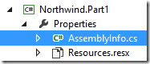
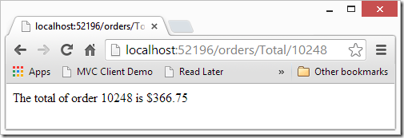

# The visibility problem (internal vs public)

Note that the Orders member in the parent class is marked “internal” and also the “v_Total” column, and the Run method for the “Total” class is also internal.
That means that it is only accessible to code that exists in that project – and not to the code we are about to write in the NorthwindWeb MVC project.

The conventional thing to do is to change all these members to public – that’s a perfectly good way to go – but as a lazy person – I always look for alternative.

In comes the “InternalsVisibleTo” attribute. An attribute that when you add it to the “assemblyInfo.cs” file it enables specific other projects to see the internal members of this project – as if they were the same project.

So in our case, we’ll go to the “AssemblyInfo.cs” file in the “Northwind.Part1” project:  

And add the following line:  

This will cause the “Northwind.Part1” project show all of it’s internal members to the “NorthwindWeb” project, saving us the trouble of changing all of it’s members to public.

There is a philosophical question of weather or not it’s a good thing – with good points to both sides, but I won’t get into it now.

So all that is left for us is do in “Northwind.Part1” project, is to change the “Totals” inner class to be internal (or public) so that we can see it from the “NorthwindWeb” project.

Now let’s start using it:

First we’ll add a reference to the “Northwind” project. The northwind project holds the ApplicationCore class for the Northwind application, which is executed whenever a controller is called – see notes at end of article about this.

In our MVC project, we’ll add an Orders Controller – just like before, and write the following code:

This is the result we’ll get in the browser:  

That’s it – it’s working. Now let’s explain each and every line:

* in line 13 we define an instance of the “ShowOrders” class which we’ll use for the “Totals” class later which needs it.
* In line 14 – we set the Orders.OrderID with the value that we received as parameter.  
As we are not actually running the “ShowOrders” controller – we don’t have to worry about this value being updated to the database, or any recompute that it may have – all of this only happens when we run the controller – so as far as we are concern – it’s the same as updating local columns.  
* In line 15 we create an instance of the “Totals” inner class and send to it’s constructor the “ShowOrder” instance we created earlier and then we run it – so it’ll perform it’s data.  
* The “Totals” inner class updates the “v_Total” column in it’s parent class with the total that we need.  
* Last in line 16, we create our result string extracting the value of the “v_Total” column from the instance of the “ShowOrders” class.

**Note** that we are running the child BusinessProcess (ShowOrders.Totals) without running it’s parent UIController (ShowOrders) – we are simply mocknig the UIController by setting it’s values without running it.