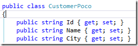
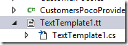

# POCO Creator – Automatically Create POCO Object Based on Entities (T4 Templates)

This article is a part of a series of articles about reusing code from a migrated application in a web project.

To configure and setup a MVC application that reuses migrated code, see Setting Up an MVC Project that Reuses Migrated Code.

Next I recommend you read these articles in the following order:

1. Creating My First MVC Page
2. Using POCO Objects Based on Migrated Entities
3. POCO Creator– Automatically Create POCO Object Based on Entities, (T4 Templates) – this article
4. POCO Creator, next step–extending the generated objects
5. Reusing Migrated Reports on the Web

In my previous article, I described how to create a basic POCO Object, which has simple members with simple types.

But sometimes I would like to have a POCO Object that will be similar to my entities.
In the previous example I created a partial object that only included some of my Customer Entity columns, but what if I want it all? That’s a lot of work!

I would have to create 11 properties, like these:  

I would have to create a “CustomerPocoProvider” that will have update, delete, insert and select methods.  
And also there I will have to create 11 assignment statements that update the POCO Object based on my Entity:  

And 11 update statements that update my Entity based on that POCO:  

This seems like a lot of work, specifically if I have 800 tables, with 20,000 fields. That’ll be like a 100,000 lines of code without any sophistication in them, just to bridge to the Entities.

That got me thinking about code generation, “if a machine can write it, why would not it?”

My first Idea was to create these kind of objects in the migration, BUT what if in the future I would like to add a new column or a new entity, then I’ll still have to do it my self.

So after some investigation, I found that there is a Visual Studio Feature – called T4 Templates, which is a framework that allows you to automatically generate code in Visual Studio. I’ll explain a little about it now, but if you want to learn more I suggest you start looking here.

First I’ll do a simple demo, to explain it’s strength, later I’ll show how to use it in the Entities context.

So in my Northwind.Poco project I’ll add an item and choose TextTemplate:  

I’ll get the following code (I’m using a resharper extension to get syntax highlighting, you’ll probably see it in black and white):  
  

In the “extension” setting I’ll change it from “.txt”, to “.cs”, so it’ll create a C# file.  

Now (after I save) in the solution explorer I’ll open the little + next to the “TextTemplate1.tt” file, and I’ll see a “cs” file that is empty, but will later hold all of my generated code:  

Next I’ll write some C# code in my template, which will be put in my C# file:  

When I save the file, the “TextTemplate1.cs” file will look like this:  

So far, so good.

Now let’s make it interesting, let’s add the following code:

Now when I save the file, it’ll look as following:  

Now that we can do this, we can do anything. With a little use of reflection, and some spare time we can do better.

