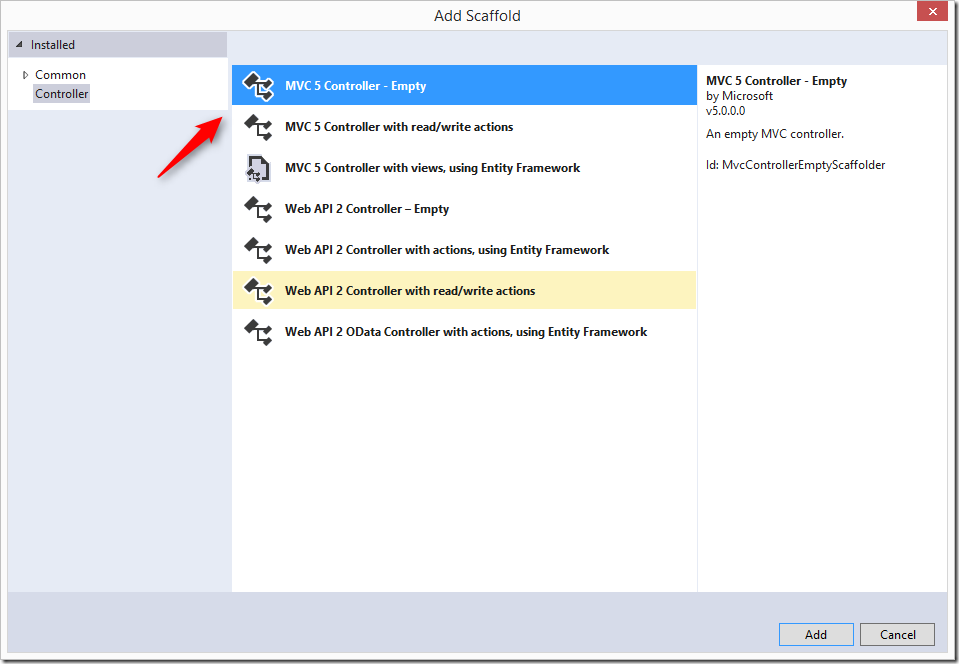
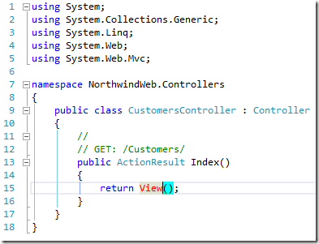
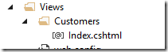
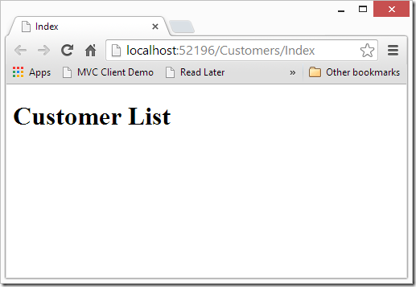

# Creating my first MVC page

This article is a part of a series of articles about reusing code from a migrated project in a web project.

To configure and setup an MVC application that reuses migrated code, see Setting up an MVC project that reuses migrated code

Next I recommend you read the following articles in the following order:

1. Creating my first MVC page – this article
2. Using POCO Objects Based on Migrated Entities
3. Poco Creator–automatically create poco object based on entities, (T4 Templates)
4. Poco Creator, next step–extending the generated objects
5. Reusing Migrated Reports on the Web

This article will show you how to create your very first, quick and dirty, MVC page.

In later articles we’ll explain how to do it better.

This article requires the setup described in the setting up of a MVC project that reuses migrated code article.

I will not go into a detailed explanation of what MVC is and what role it fills. I’ll just explain what I do in this case and you can read about MVC everywhere else on the web. Smile

## Customer List

The goal is to show a list of all the customers in the database.

We’ll first focus on the MVC stuff, and then focus on the migrated code stuff.

We’ll start by adding a controller, and call it CustomersController:

To do so, right click on the Controllers folder, and choose Add Controller.  
  
Choose Empty MVC Controller:  
  

And name it CustomersController:  

This will add the CustomersController:  
  

Note that a method called “Index” was created. That is the default method that will be called when we access this controller. Meaning, that when we use the following url “localhost/customers,” this method will be called. It’s the same as “local/customers/index”.

Next, we would like to create it’s View:

Right click the “View()” text and select add Controller:  
  
  
Since this is a basic demo, which focuses on the migrated code, we’ll uncheck the “Use a layout page”. In a real MVC application, you’ll probably have a layout page to help you.

The following file was created:  
  

And it was created in the following folder:  

We’ll add the following line to the cshtml file:  
  

Now when we run the application and go to the “/customers” url we’ll get the following result:  
  

So far we have done the basic MVC stuff, now let’s get the actual customers.

Back in the ClientsController, let’s create a list of strings, and use the customers entity to populate it, and send it to the View:  
  

Whatever we send to the View method as a parameter is accessible in the index.cshtml file as the “Model” member.

So now in the index.cshtml, we can use it, and write the following code:  
 

Now when we’ll run this, we’ll get the following result:

That’s it, we now can reuse code from the migrated application in our web application.

There is great potential of the types of code we can reuse.

In this sample, I used a list of strings to display the customers. In the next posts, we’ll use more complex data types also known as “POCO”s.

Next I recommend that you read: Using POCO Objects Based on Migrated Entities