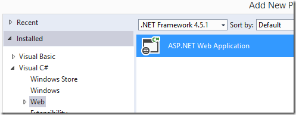

# Setting up an MVC project that reuses migrated code

This article is a part of a series of articles about reusing code from a migrated project in a web project.

To configure and setup an MVC application that reuses migrated code, see Setting up an MVC project that reuses migrated code – this article

Next I recommend you read the following articles in the following order:

1. Creating my first MVC page
2. Using POCO Objects Based on Migrated Entities
3. Poco Creator–automatically create poco object based on entities, (T4 Templates)
4. Poco Creator, next step–extending the generated objects
5. Reusing Migrated Reports on the Web
 
In the next set of posts, I’m going to discuss usage of migrated code in the context of an MVC web application.

In my previous post about migrated reports in MVC web applications I’ve explained how to reuse a report we already had in the application, but I didn’t explain how to setup and configure the MVC web project.

Using the MVC technology and its advantages is extremely easy, but the setup takes some configuring.

The paradox is that before we enjoy and understand the technology, we need to do the setup at the point when we know the least about how to do it. Smile

So let’s cover that now:

I’m starting with a standard migrated project:  

We’ll start by adding a MVC project. I’m using Visual Studio 2013, the following screens may look different in other versions of Visual Studio:  
  

We’ll choose the “ASP.NET Web Application” project template:  

And in the Properties window, I’ll select the “Empty” template and check the “MVC” checkbox:  

This is the expected result:

