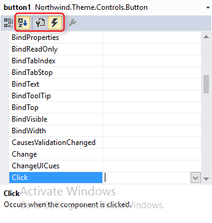

### Events
1.	In .NET each control exposes several **events** that can be used to react to user inputs. We will now explore the event of a button click.
2.	Using the Toolbox, drag a button to the ShowOrders form.

3.	Change the Text property from button1 to ClickOnMe 
4.	Switch to the event list of the textbox. Sort the list in alphabetical order.

5.	Double click on the Click event and add the following message:
```
private void btnClick_click(object sender, ButtonClickEventArgs e)
{
    MessageBox.Show("Just clicked on a button!");
}
```
6.	Build and run.