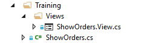
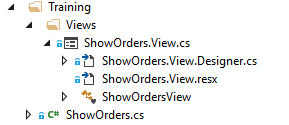

### 4.6.3	Understanding the Form code files
1.	When we click on the Form icon in the solution explorer, the designer of the form is opened.

2.	 We can also expand the Form and click on the last child node to open **the code behind of the Form**, where all the event handlers are located. For example, we can see our handler for the button click event that we added earlier.

   

3.	Notice that the code view and the designer view are the same file. We just have 2 different ways to display it.
4.	In addition, the Form class has 2 more files, which are used by Visual Studio. During the training, we are not going to touch them and they can be ignored. Just a word about them and nothing more:
      a.	**ShowOrders.View.Designer.cs** – This code file is automatically generated when we design the form using the Visual Studio designer. This file should not be modified with the code editor, as the changes might be overwritten
      b.	**ShowOrders.View.resx** – When we add an icon or an image controls to our form, the image files are saved in the resources file (resx). This file is also use for localization which is outside our scope.
      
5.	Exercise: Control’s Events

