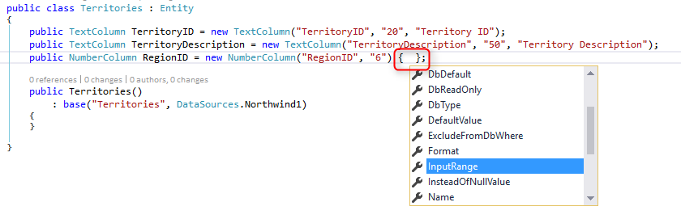
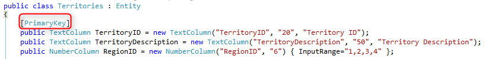

### Creating New Entities

1.	So far, we have used existing **entities** to create our screens, but sometimes we need to add new **entities** to our application. Let’s create a new entity 
2.	Notice that we don’t have an entity class for the “Territories” table that exists in the SQL Database.
3.	Under the “Models” folder, add a new item and select the **“Entity”** template from the **“Firefly”** category. Set the name of the class to “Territories”.
4.	Review the entity class.
* Notice that the first parameter in the entity constructor is the **name** and should be **identical** to the table name, as it is in the database.
* Change the name and data source as follows.
    
```
namespace Northwind.Models
{
    public class Territories : Entity
    {

        public Territories()
            : base("Territories", DataSources.Northwind1)
        {
        }

    }
}
```
 *	The **DataSources** class includes all the databases that are used by the application, like the databases list in Magic settings menu. 
 *	Don't worry if you don't understand some of the syntax like the colon (:) or the **"base"** keyword. We'll get to that   later.
5.	Let's add some **columns** to this entity. Please add the following **columns**:

```
public class Territories : Entity
{
    public TextColumn TerritoryID = new TextColumn("TerritoryID", "20", "Territory ID");
    public TextColumn TerritoryDescription = new TextColumn("TerritoryDescription", "50", "Territory Description");
    public NumberColumn RegionID = new NumberColumn("RegionID", "6");

    public Territories()
        : base("Territories", DataSources.Northwind1)
    {
    }

}
```
* **Data type** (TextColumn, NumberColumn) is according to the type of the column in the database.
* The first parameter is the **DB Name** and should be identical to the Database column name.
* The second parameter which is the **Format type**, should be no larger than the size definition in the database. For more information about formats, please check the related article.
* The third parameter is the **caption** which can be specified.
* These three most common parameters are part of the column properties list which can be accessed within curly brackets { } following the parenthesis:


```csdiff
public class Territories : Entity
{
    public TextColumn TerritoryID = new TextColumn("TerritoryID", "20", "Territory ID");
    public TextColumn TerritoryDescription = new TextColumn("TerritoryDescription", "50", "Territory Description");
-   public NumberColumn RegionID = new NumberColumn("RegionID", "6");
+   public NumberColumn RegionID = new NumberColumn("RegionID", "6"){ }

    public Territories()
        : base("Territories", DataSources.Northwind1)
    {
    }

}
```

In the example below, please set the range of the RegionID column between 1 and 4:


```csdiff
public class Territories : Entity
{
    public TextColumn TerritoryID = new TextColumn("TerritoryID", "20", "Territory ID");
    public TextColumn TerritoryDescription = new TextColumn("TerritoryDescription", "50", "Territory Description");
-   public NumberColumn RegionID = new NumberColumn("RegionID", "6"){ }
+   public NumberColumn RegionID = new NumberColumn("RegionID", "6"){ InputRange = "1,2,3,4" }

    public Territories()
        : base("Territories", DataSources.Northwind1)
    {
    }

}
```

#### Primary Key

1.	Every entity must have a primary key, which is a unique identifier of the row.
2.	A primary key can be one or more columns that has the `[PrimaryKey]` attribute above them (for more than one column, the order of the columns in the class is the order of the primary key segments).


```csdiff
public class Territories : Entity
{
+   [PrimaryKey]
    public TextColumn TerritoryID = new TextColumn("TerritoryID", "20", "Territory ID");
    public TextColumn TerritoryDescription = new TextColumn("TerritoryDescription", "50", "Territory Description");
    public NumberColumn RegionID = new NumberColumn("RegionID", "6"){ InputRange = "1,2,3,4" }

    public Territories()
        : base("Territories", DataSources.Northwind1)
    {
    }

}
``` 
3.	Build and run.
4.	Notice that when you add a new Entity to the project it is automatically been added to the Models Repository (SHIFT-F2) and you can also browse it from there.
5.	Exercise: Creating New Entity

