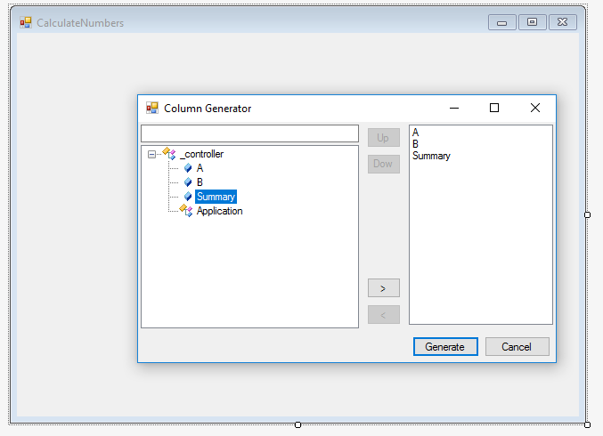

### Updating Data Programmatically
1.	Under the Training folder, add a new item and select the UIController template from the firefly category, set the name of the UIController to “CalculateNumbers”.
2.	Add the following NumberColumns and build.

3.	Place a button on the screen and name it "Calculate"
4.	Set the property `AllowFocusWithoutBoundColumn=True` (This means that unlike Magic, you can park on the button without binding it to a local column)

5.	Go to the Click event (Double click on the button to go into the event code)
6.	Set Summary value with A+B
```
private void button1_Click(object sender, ButtonClickEventArgs e)
{
+    _controller.Summary.Value = _controller.A + _controller.B;
}
```
7.	Add a menu entry in the **Application.MDI** to browse the new created program.
8.	Build and Run
9.	Notice that the calculation occurs only when the button is clicked.

10.	Review the UIController slides in the Power Point presentation. (#7 - #21)
11.	Exercise: Updating Data Programmatically
