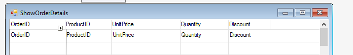

### Input Parameters

1.	Create a new UIController named “ShowOrderDetails” in the training folder.
```csdiff
public class ShowOrderDetails : UIControllerBase
{
+    public readonly Models.OrderDetails OrderDetails = new Models.OrderDetails();

    public ShowOrderDetails()
    {
+        From = OrderDetails;                        
    }
```
2.	Build and put the following columns on a grid:


3.	In "ShowOrders", place a button at the bottom of the screen and set its Text to “Details”.
4.	Double click on the button and call to the “ShowOrderDetails” in the controller 
```csdiff
private void button2_Click(object sender, ButtonClickEventArgs e)
{
+            new ShowOrderDetails().Run();
}
```
5.	Build and run.
6.	As you can see, there is no "where" criteria and all the orders are displayed.
7.	To add a criteria based on the orderID, go to the Run method in "ShowOrderDetails" and add the following parameter with a Where.Add line of code inside the Run method to filter the data according to the input parameters.
```csdiff
- public void Run()
+ public void Run(Number orderId)

{
+   Where.Add(OrderDetails.OrderID.IsEqualTo(orderId));
    Execute();
}
```

8.	The `Where.Add` can be written inside the Run method, as long as it’s before the calling to the `Execute` method.
9.	In “ShowOrders” designer, add the `orderId` from the controller. 
```csdiff
private void button2_Click(object sender, ButtonClickEventArgs e)
        {
-            new ShowOrderDetails().Run();
+            new ShowOrderDetails().Run(_controller.Orders.OrderID);
        }
```

10. Build and run. 
11. Call to “ShowOrderDetails” from different rows and see that the data in the second screen matches the values of the current row in the calling screen. 
12. Exercise: Input Parameters

