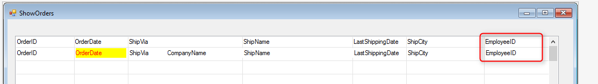

### Migrated Style Parameters

1. We have used a simple type parameter such as `Number` when we just needed to know the value, but if we needed to update the value back to the calling program, we have used the “column” type such as `NumberColumn`. This is the thumb rule of using parameters.
2. Notice that the Number type also accepts a `NumberColumn` object because the `NumberColumn` can be implicitly converted to `Number` and in this case the value of the column is used. This is the same for all the columns: `TextColumn`, `DateColumn` etc.
3. However, a `NumberColumn` type parameter won’t accept a Number, because	 it expects a column object, usually in order to update its value property back to the calling program.
4. However, in Magic, there was no difference in the program that accepts the parameters. In other words, a numeric parameter in Magic accepts either a numeric expression (`Number`) or a numeric column (`NumberColumn`). It was for the calling program to decide what to send.
5. In order to support this in the migrated code, there are 5 types for parameters: `NumberParameter`, `TextParameter`, `BoolParameter`, `DateParameter` and `TimeParameter`. 
_**Note**_: There are also `ByteArrayParameter` (Blob) and `ArrayParameter` (Vector).
6. First, we will start with a new selection screen to the employee ID, we will add the employeeID to the ShowORders Screen;

8.	And now we will create a new UIController "SelectEmployee" 
```diff  
using System;
using System.Collections.Generic;
using System.Text;
using System.Drawing;
using Firefly.Box;
using ENV;
using ENV.Data;

namespace Northwind.Training
{
    public class SelectEmployee : UIControllerBase
    {
+        public readonly MyModels.Employees Employees = new MyModels.Employees();
+        NumberColumn _employeeID = new NumberColumn();

        public SelectEmployee()
        {
+        From = Employees;
        }

-        public void Run()
+        public void Run(NumberParameter pio_employeeID)
        {
+            // _employeeID = pio_employeeID;
+            BindParameter(_employeeID, pio_employeeID);
+            StartOnRowWhere.Add(Employees.EmployeeID.IsEqualTo(_employeeID));
           Execute();
        }

        protected override void OnLoad()
        {
+           AllowSelect = true;
            View = () => new Views.SelectEmployeeView(this);
        }
+       protected override void OnSavingRow()
+       {
+           _employeeID.Value = Employees.EmployeeID;
+       }
    }
}
```
10. Use the expand event on the employeeID textbox to call the new select program.
11. add in ShowOrders.View.cs :
```diff
+ private void txtEmployeeID_Expand()
+        {
+            _controller.SelectEmployee();
+        }
```
12. add in ShowOrders.cs :
```diff
+ internal void SelectEmployee()
+        {
+            new SelectEmployee().Run(Orders.EmployeeID);
+        }
```
13. Now we will see what happened if we change the calling program from calling using a value or calling using a column.
14. The next program will show that we can now move the where to the contractor.
15. Below is an example (Comment out the existing Run method that accepts parameters):
```diff
public class ShowOrderDetailsWithParameter : UIControllerBase
{
+    internal Models.OrderDetails OrderDetails = new Models.OrderDetails();
+    NumberColumn OrderID = new NumberColumn();
    public ShowOrderDetailsWithParameter()
    {
+     From = OrderDetails;
+     Where.Add(OrderDetails.OrderID.IsEqualTo(OrderID));

+     Columns.Add(OrderID);

+     View = () => new Views.ShowOrderDetailsWithParameterView(this);
    }

-    public void Run()
+    public void Run(NumberParameter pOrderID)
    {
+       BindParameter(OrderID, pOrderID);
        Execute();
    }

-    protected override void OnLoad()
-    {
-        View = () => new Views.ShowOrderDetailsWithParameterView(this);
-    }
}
```
16. The `BindParameter` is a method that copies the value from the parameter to a local column. At the end of the execution it copies the value back from the local column to the parameter in order to affect the calling program if needed.
17. Notice that the filter can be put in the constructor, as the values will be updated by the `BindParameter` method before that task is executed.
18. In "ShowOrders" comment out the call to "ShowOrderDetails" and call ShowOrderDetailsWithParameter" instead:
```diff
private void button2_Click(object sender, ButtonClickEventArgs e)
{
-    new ShowOrderDetails().Run(_controller.Orders.OrderID);
+    new ShowOrderDetailsWithParameter().Run(_controller.Orders.OrderID);
}

```

Exercise: Migrated Style Parameters