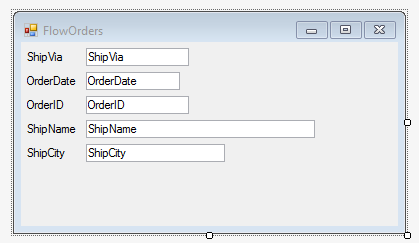

### Tab order in a FlowUIController

1.	In a FlowUIController, the tab order on the screen always follows the columns order in the controller class. That is the order in which the columns are added to the columns collection of the controller. Changing the Tab Index property will not have any affect.
2.	Add the columns to the screen using the Form ColumnWizard(right click on the screen with no grid – column wizard)  in a different order from the columns collection, as follows:

3.	Add the program to the main menu and run it.
4.	Notice that the tab order is according to the columns collection and not the order of the columns on screen.
5.	Exercise: Tab Order in FlowUIController
