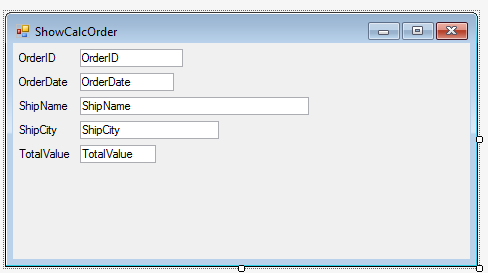

### Calling a BusinessProcess from another program
1.	Create a new UIControler name "ShowCalcOrder":
```csdiff
public class ShowCalcOrder : UIControllerBase
{

+    public Models.Orders Orders = new Models.Orders();
+    public NumberColumn TotalValue = new NumberColumn();

    public ShowCalcOrder()
    {
+        From = Orders;
    }
```


2.	Add the program as a menu entry
3.	Run the program and see how it works. The total will be zero because we haven’t implemented its calculation yet.
4.	Create a new BusinessProcess named "CalculateOrderTotal":
```csdiff
public class CalculateOrderTotal : BusinessProcessBase
{
        
+    public readonly Models.OrderDetails OrderDetails = new Models.OrderDetails();
+    public NumberColumn _total;

    public CalculateOrderTotal()
    {
+       From = OrderDetails;
    }
-   public void Run()
+   public void Run(Number orderID , NumberColumn total)
    {
+        _total = total;
+        Where.Clear();
+        Where.Add(OrderDetails.OrderID.IsEqualTo(orderID));
        Execute();
    }
    
+    protected override void OnStart()
+    {
+        _total.Value = 0;
+    }

+    protected override void OnLeaveRow()
+    {
+        _total.Value += OrderDetails.Quantity * OrderDetails.UnitPrice - OrderDetails.Discount;
+    }
}
```

5.	Call the BusinessProcess from the `OnEnterRow` method of the UIController "ShowCalcOrders":
```csdiff
protected override void OnEnterRow()
{
    new CalculateOrderTotal().Run(Orders.OrderID, TotalValue);
}
```
6. Add a new menu entry to call to this screen.
7. Exercise: Calling a BusinessProcess from another program
