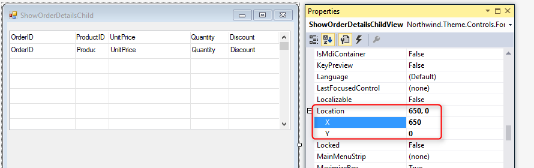

### ShowOrderDetailsChild
1.	Add a UIController named 'ShowOrderDetailsChild', which accepts a Number OrderID and display a grid with the order details lines.
2.	Notice that **we don’t use the `KeepViewVisibleAfterExit`** just yet:
```diff
namespace Northwind.Training
{
    public class ShowOrderDetailsChild : UIControllerBase
    {
+       public readonly Models.OrderDetails OrderDetails = new Models.OrderDetails();

        public ShowOrderDetailsChild()
        {
            From = OrderDetails;
        }

-       public void Run()
+       public void Run(Number orderId)
        {
+           Where.Clear();
+           Where.Add(OrderDetails.OrderID.IsEqualTo(orderId));
            Execute();
        }

        protected override void OnLoad()
        {
            View = () => new Views.ShowOrderDetailsChildView(this);
        }
    }
}
```
3.	Now, to the screen designer. Add the following columns and In change the `X location` of the Form to **650**:
