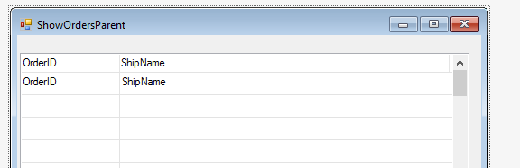
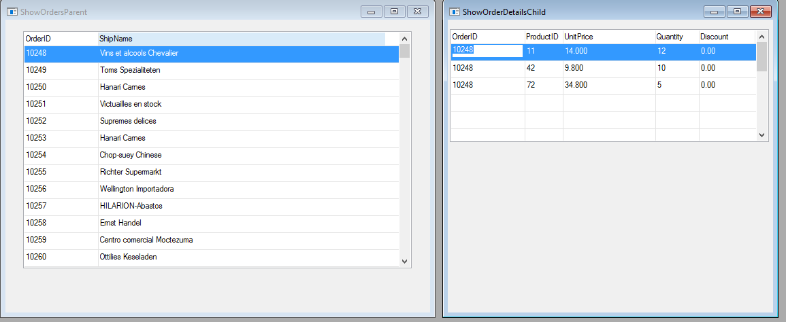

### ShowOrdersParent
1.	Add a second UIController named 'ShowOrdersParent' and call to 'ShowOrderDetailsChild' inside the `OnEnterRow` method:
```csdiff
namespace Northwind.Training
{
    public class ShowOrdersParent : UIControllerBase
    {
+       public readonly Models.Orders Orders = new Models.Orders();

        public ShowOrdersParent()
        {
            From = Orders;
        }

+       protected override void OnEnterRow()
+       {
+           new Training.ShowOrderDetailsChild().Run(Orders.OrderID);
+       }
```
2.	Put only the following columns on the screen:


3.	Now, let’s **add the `ShowOrdersParent` to the main menu** and see how it works.
4.	Run the application and notice the following when opening the ShowOrdersParent screen:
    a.	As soon as we enter the screen we can see both the ShowOrdersParent and the ShowOrderDetailsChild.


    b.	When we press ESC, **the ShowOrderDetailsChild screen is closed**.
    c.	When we enter a new row on the left screen (ShowOrdersParent), the ShowOrderDetailsChild is opened again and take the focus.
5.	So far, **we did not do anything new**. All we did is based on the things we have already learned and know.
    