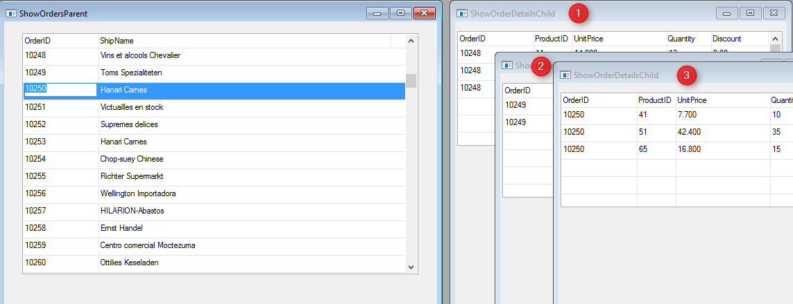

### We need to use the Cached method
1.	We still have one problem that revels when dragging the right window:

2. For each row we enter to on the left screen (`ShowOrdersParent`), a new instance of the right screen (`ShowOrderDetailsChild`) is created. 
3.	This can be easily fixed by using cached when calling the `ShowOrderDetailsChild`. 
Go to the `OnEnterRow` method of the `ShowOrdersParent` controller and change the code as follows:
```csdiff
protected override void OnEnterRow()
{
-    new Training.ShowOrderDetailsChild().Run(Orders.OrderID);
+    Cached<ShowOrderDetailsChild>().Run(Orders.OrderID);
}
```
4.	Run the application and open the screen. Now it works as expected.
5.	Exercise: KeepViewVisibleAfterExit
