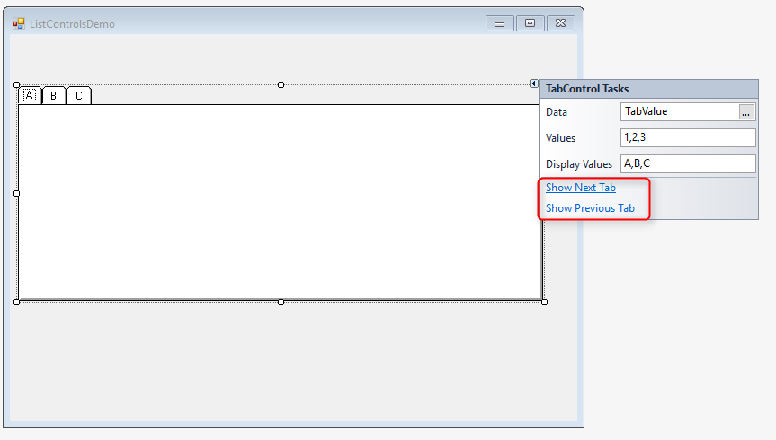
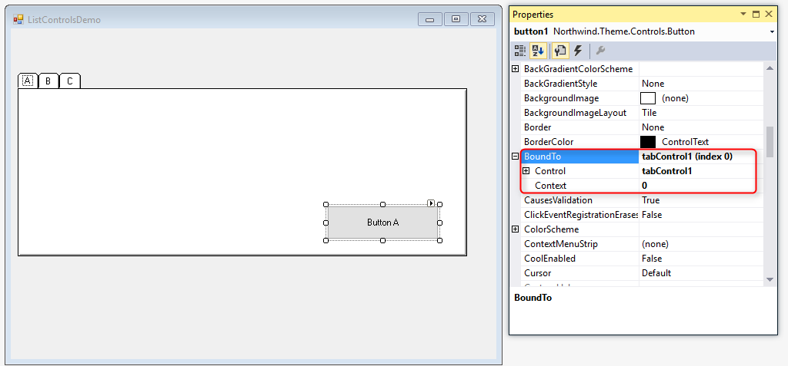
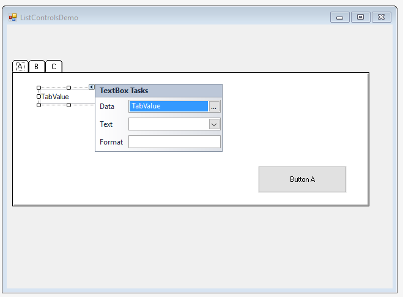

### Tab Control
1.	Create a new UIController named `ListControlsDemo`.
2.	Add a public `NumberColumn` named `TabValue`. Add it to the Columns collection.
```diff
public class ListControlsDemo : UIControllerBase
{
+   public NumberColumn TabValue = new NumberColumn();

    public ListControlsDemo()
    {
+       Columns.Add(TabValue);
    }
```
3.	Place a tab control on the form and set its data to be the `TabValue` column.
4.	Set the `Values` property to be “1,2,3”
5.	Set the `DisplayValues` property to be “A, B, C”
6.	The `DisplayValue` is the Tab name  end user sees while the Values are the return value of that tab (User see A and its reference is 1)
7.	You can surf between the tabs using the Tab property screen:

8. Add a button to the first tab and set its text to be “Button A”.
9. Add the program to the main menu.
10. Run the program and you will see that the button is linked to all the tabs
11. In order to bind the button only to the first tab, park on the button and open its properties.
12. Expand the `BoundTo` property and set it as follows:
    a. `Control`: tabControl1 - this is the Tab name.
    b. `Context` : 0  - This is the first tab (zero-based index similar to an Array)

13. Add 2 more buttons to the other tabs.
14. Run the program.
As you can see, there is no default tab selected. Set a default value to the TabValue column.
```diff
- public NumberColumn TabValue = new NumberColumn();
+ public NumberColumn TabValue = new NumberColumn() { DefaultValue =1 };
```
15. Add a textbox below the tab control and attach it to a method that returns the TabValue.
```diff
+ public Number TabReturnValue()
+ {
+     return TabValue;
+ }
```

16. Run the program and show that the textbox value is changed according to the selected tab.

17. Exercise: List Controls – Tab 
