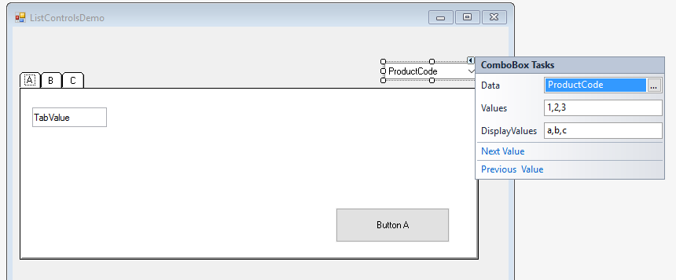

### ListSource
1.	In the ListControlsDemo class, add a `NumberColumn` named “ProductCode”. Add it to the columns collection.
```csdiff
public NumberColumn TabValue = new NumberColumn() { DefaultValue =1 };
+ public NumberColumn ProductCode = new NumberColumn();

public ListControlsDemo()
{
    Columns.Add(TabValue);
+   Columns.Add(ProductCode);
}
```
2.	Add a **ComboBox** and set its data to the “ProductCode” column.
3.	Notice that the ComboBox has the same "Values" and "DisplayValues" properties, as any list control.
4.	Add some values and display values.

5.	Run the program and demo the combo box values.
6.	Reset the "Values" and "DisplayValues" and set the "ListSource" property, as follows:
```csdiff
public ListControlsDemoView(ListControlsDemo controller)
{
    _controller = controller;
    InitializeComponent();

+   var products = new Models.Products();
+   comboBox1.ListSource = products;
+   comboBox1.ValueColumn = products.ProductID;
+   comboBox1.DisplayColumn = products.ProductName;
}
```
7.	Run the program and demo
8.	Show the `ListWhere` and `ListOrderBy` properties.
```csdiff
public ListControlsDemoView(ListControlsDemo controller)
{
    _controller = controller;
    InitializeComponent();

    var products = new Models.Products();
    comboBox1.ListSource = products;
    comboBox1.ValueColumn = products.ProductID;
    comboBox1.DisplayColumn = products.ProductName;
+   comboBox1.ListWhere.Add(products.CategoryID.IsEqualTo(1));
+    comboBox1.ListOrderBy.Add(products.ProductName, SortDirection.Descending);
}
```
9. Run the program and demo.

10. Exercise: List Controls – ListSource
11. Exercise: List Controls - Summary
