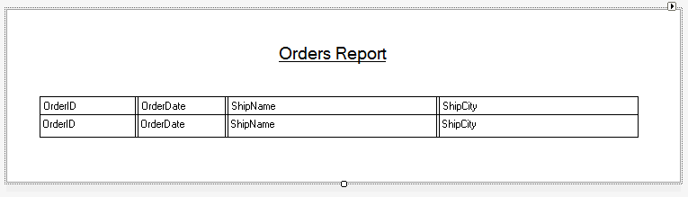

### Introduction to Reports

1.	A **report** is a special kind of **BusinessProcess** that has a **printing layout** that can be printed to a **printer** or saved as **PDF** file.
2.	Let’s see a simple example.
3.	Create a new item and select the “BasicReport” template from the “Firefly” category. Name it `OrdersReport`.
4.	Review the files that were created by the template:
    i. The BusinessProcess class where all the logic code sits in.
    ii. The Layout class under the Printing folder, where the report design sits in.
5.	Start with the BusinessProcess class and review the following:
    i. `_layout` – a reference to get to the _layout of the report.
    ii. `_printer` – a PrinterWriter object that communicate with the printing device (like IO in Magic).
Go over some of the properties you can set in the curly brackets.
(copies, landscape, pdf…)
    iii.	Inside the constructor of the class:
          1. `_layout` is being initialized.
          2. `Streams.Add` – adds the _printer object to the BusinessProcess Streams collection. The BusinessProcess is responsible of opening and closing the connection with the printing device.
          3. `_printer.PrintPreview` - the template’s default is true to save trees…
    iv. The `OnLeaveRow` already contains the code that writes each line to the report layout body section. We will get to that shortly.
6.	Add the entity definition and set the From as follows:
```diff
public class OrdersReport : BusinessProcessBase
{

+   public readonly Models.Orders Orders = new Models.Orders();

    PrinterWriter _printer;
    Printing.OrdersReportLayout _layout;

    public OrdersReport()
    {
+        From = Orders;
    }
```
7. Build and open the layout in design view.
8. Add a **label** control for the title from the **`Northwind.Theme.Printing`** namespace and set the title text to “`Orders Report` and the following label properties:
    i. `Font` -> size = 14
    ii. `Font` -> Bold = true
    iii. `Font` -> Underline = true
    iv. `Alignment` = middle Center
9.	Add a grid control from the `Northwind.Theme.Printing` namespace and add the following columns:

10. Add a menu to call to this report.
11. Build and run. Show all the options in the Print Preview.

l2. Exercise: Basic Report

