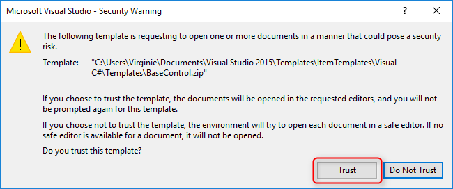
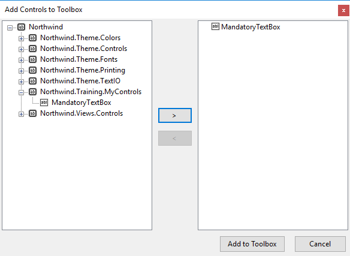
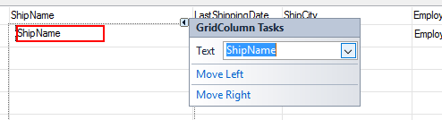

### Creating Base Controls 
1. Sometimes we want to create a base class for a button, a textbox or any other control. This helps to keep a standard look and feel of the application. In Magic the GUI models where at the same repository with the data models.
2. Create a new folder named **MyControls** in the **Training** folder.
3. Add a new item and select the **BaseControl** template from the **Firefly** category. Set the name to **MandatoryTextBox**.
4. You might get the following message the first time you use the **BaseControl** template. Click on Trust.

5. The control designer will open and actually there is nothing to see. This is how Visual Studio control designer works. Press F7 to switch to Code View and review the template. Explain that by default the class inherits the TextBox control. If you need another control like Button or Grid, just change the class inheritance accordingly.
6. Press SHIFT+F7 to switch back to Design View and then F4 to show the Properties window.
7. Change the following properties of the textbox:
    a. Border = **Thick**
    b. BorderColor = Red
    c. Style = **Flat**
8. Notice that we can set the properties as we like, but Visual Studio doesn't show the result, so it is recommended to play with some textbox that exists on a screen and when we are happy with the results, set the same properties to our base control. 
9. Now, we need to add the MandatoryTextBox to our toolbox. Right click on any form in designer and select “Add Controls to Toolbox…”. Find the control you added and add it.

10. In “ShowOrders”, replace the “ShipName” textbox with a MandatoryTextBox and select ShipName Data.

11. Build and run. 
12. Exercise: Creating Base Control 
