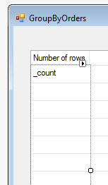

### SQLGroupBy
1.	Sometimes we need a "Group By" query in our application. So far, the only way to do it was using complex SQL queries. Now it can be a much simpler task.
2.	Create a UIController "GroupByOrders" that displays a list of titles that the sum of the "TotalPayedToDate" for Titles with more than 2 purchases.
##### Example 1 – **Simple Select Count(*):**
```diff
public class GroupByOrders : UIControllerBase
{

+   public readonly Models.OrderDetails OrderDetails = new Models.OrderDetails();
+   public NumberColumn _count = new NumberColumn("Number of rows", "6");

    public GroupByOrders()
    {
+       var groupBy = new SQLGroupBy(OrderDetails);
+       groupBy.AddCountColumn(_count);
+       From = groupBy.Entity;
    }
```
* Place the _count local column on the grid 
 

##### Example 2 – **Adding Column**:

Please add another column to the grid to Group By the OrderID 
```diff
public GroupByOrders()
{
    var groupBy = new SQLGroupBy(OrderDetails);
    groupBy.AddCountColumn(_count);
+   groupBy.AddColumn(OrderDetails.OrderID);
    From = groupBy.Entity;
}
```
##### Example 3 – **Adding Where Clause:**

Filter the view with UnitPrice > 20
```diff
public GroupByOrders()
{
    var groupBy = new SQLGroupBy(OrderDetails);
    groupBy.AddCountColumn(_count);
    groupBy.AddColumn(OrderDetails.OrderID);
+    groupBy.Where.Add(OrderDetails.UnitPrice.IsGreaterThan(20));
    From = groupBy.Entity;
}
```
##### Example 4 – **Adding Having: (Filer for GroupBy aggregate actions)**

Filter the view to display orders with more than two rows.
```diff
public GroupByOrders()
{
    var groupBy = new SQLGroupBy(OrderDetails);
    groupBy.AddCountColumn(_count);
    groupBy.AddColumn(OrderDetails.OrderID);
    groupBy.Where.Add(OrderDetails.UnitPrice.IsGreaterThan(20));
+   groupBy.Having.Add(_count.IsGreaterThan(2));
    From = groupBy.Entity;
}
```
##### Example 5 – **Adding Sort:**
```diff
public GroupByOrders()
{
    var groupBy = new SQLGroupBy(OrderDetails);
    groupBy.AddCountColumn(_count);
    groupBy.AddColumn(OrderDetails.OrderID);
    groupBy.Where.Add(OrderDetails.UnitPrice.IsGreaterThan(20));
    groupBy.Having.Add(_count.IsGreaterThan(2));
+   groupBy.OrderBy.Add(_count, SortDirection.Descending);
    From = groupBy.Entity;
}
```
##### Example 6 – **Adding a Total column**:
AddAggregateColumn – performs an Aggregate operation (count, sum, min, max, avg) on a value of a colum
AddSumColumn – sums columns, AddCountColumn – counts columns
Add another column to the grid - _TotalQuantity 
```
public class GroupByOrders : UIControllerBase
    {

        public readonly Models.OrderDetails OrderDetails = new Models.OrderDetails();
        public NumberColumn _count = new NumberColumn("Number of rows", "6");
+       public NumberColumn _TotalQuantity = new NumberColumn("Total Quantity", "10.2C");

        public GroupByOrders()
        {
            var groupBy = new SQLGroupBy(OrderDetails);
            groupBy.AddCountColumn(_count);
+           groupBy.AddAggregateColumn(_TotalQuantity, "Sum({0})", OrderDetails.Quantity);
            groupBy.AddColumn(OrderDetails.OrderID);
```

#### Example 7 – Adding Join:
```
public class GroupByOrders : UIControllerBase
    {

        public readonly Models.OrderDetails OrderDetails = new Models.OrderDetails();
+       public readonly Models.Orders _orders = new Models.Orders();
        public NumberColumn _count = new NumberColumn("Number of rows", "6");
        public NumberColumn _TotalQuantity = new NumberColumn("Total Quantity", "10.2C");

        public GroupByOrders()
        {
            var groupBy = new SQLGroupBy(OrderDetails);
+           groupBy.AddLeftOuterJoin(_orders, _orders.OrderID.IsEqualTo(OrderDetails.OrderID));
            groupBy.AddCountColumn(_count);
```
3. Show the number of rows from the Purchase table and the sum next to each title.
4. Add a join relation to the Genre entity to add the Genre description to the list. Don’t forget to add the GenreDescription to the groupBy Columns collection.
5. *Note*: Make sure that all the columns that are displayed on the form are added to the data view using the AddColumn functions. Remember, all the columns on form must exist in the Group by SQL statement.
6. Exercise: SQLGroupBy