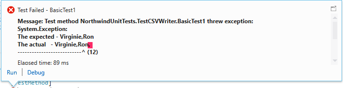

### Create the unit test class
1. Create a new item Code\Class on Northwind, and call it CSVWriter
```diff
namespace Northwind
{
-    class CSVWriter
+    public  class CSVWriter
    {
    }
}
```


2. Build it
3. Before you writing the code, you write the test you describe what would you like your code to do
4. So you go to NorthwindUnitTests project, and add reference you need : 
    * Project/Solution : ENV and Northwind  
    * Assemblies : System.Windows.Forms
5. And we add a new class, Test/Unit Test template and call it TestCSVWriter like :


```diff
using System;
using System.Text;
using System.Collections.Generic;
using Microsoft.VisualStudio.TestTools.UnitTesting;
+ using Firefly.Box.Testing;

namespace NorthwindUnitTests
{
    [TestClass]
    public class TestCSVWriter
    {
+        [TestMethod]
+        public void BasicTest1()
+        {
+            var cw = new Northwind.CSVWriter();
+            cw.Add("Virginie");
+            cw.Add("Ron");
+            cw.ToString().ShouldBe("Virginie,Ron");
+        }        
    }
}
```

```diff
using System;
using System.Collections.Generic;
using System.Linq;
using System.Text;
using System.Threading.Tasks;

namespace Northwind
{
    public class CSVWriter
    {
        public void Add(string v)
        {
-            throw new NotImplementedException();
        }
    }
}
```


6. you can see we receive an error that CSVWriter does not contain a definition for `Add`
7. So you generate the method in CSVWriter.cs (with quick actions)
8.  Build it and launch the run test
9.  The Test is Failed, show the message. ToString method use by default the name of the class
10. Add in the CSVwriter.cs :

```diff
public class CSVWriter
{
+   string _result = "";
    public void Add(string v)
    {
+        _result += v + ",";
    }
+   public override string ToString()
+   {
+        return _result;
+   }
}
```

11. Result :



12. Modify the code
```
public class CSVWriter
{
    string _result = "";
    public void Add(string v)
    {   
+        if (_result.Length > 0)
+            _result += ",";   
-        _result += v + ",";
+        _result += v ;
        
    }
    public override string ToString()
    {
        return _result;
    }
}
```
13. Test Working !
14. Now we go back to our code and start using your CSVWriter 