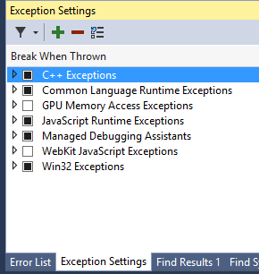
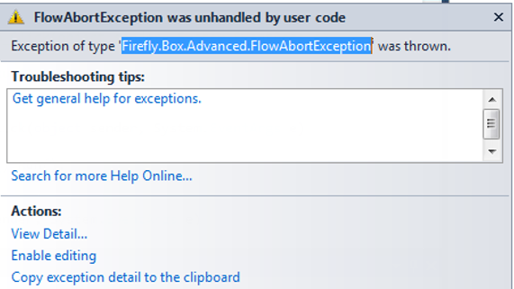
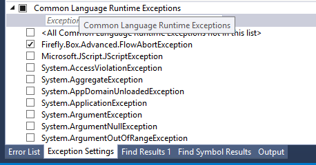

### Suppressing FlowAbortException

#### Overview

This document covers the How to Suppress the FlowAbortException. Sometimes it is helpful to see the code of an error message, and this is why we have this exception, but most of the time, we want to ignore this exception.  The following steps show how to do ignore this.   

#### Steps
1.	To access this window go to the Debug menu and select Windows -> Exception Settings.
2.	You should see the following screen

3. You can add exceptions to the list that you would like to configure to break when thrown. 
4. Click on Combo, select, Common Language Runtime Exceptions and click on + button
5. In the Name edit field, type: Firefly.Box.Advanced.FlowAbortException
6. When you first receive the flow abort exception, you can select it, as shown below and then copy and paste it into the field.

7. You now see the new exception under the Common Language Runtime Exception List. Un-click the checkbox as well. Your screen should look like this: 

8.That’s it! Now you can receive error messages and the debugger will not stop. To turn the debugger on for the ”FlowAbortException”, simply go to the Debug menu and select Windows -> Exception Settings, and mark the checkbox again. 