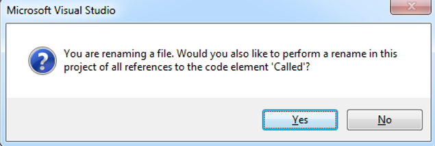

### How to Call a Program Using Abstract Factory
1.	Let’s assume that a program named “Calling” from Part1 of the application needs to call to a program named “Called” from Part2 of the application.
2.	Do the following steps to add an abstract class for the “Called” program and use the Abstract Factory pattern:
    a.	In the Base project, under the Part2 folder add a new class named “Called”, using the “Abstract Base Class” template.
    b.	The class inherits the UIControllerBase class by default. If the called program is a Business Process, change the base class to BusinessProcessBase.
    c.	If the called program has parameter of more than one Run method, add the run method as abstract methods with the same signature.
    d.	Here is the final result of the abstract base class:
```
namespace Northwind.Part2
{

   public abstract class Called : BusinessProcessBase
    {
 

       public static Called Create()
        {
            return ENV.AbstractFactory.CreateInstance<Called>();
        }
         public abstract void Run();
```
   e. Change the name of the “Called” program file from “Called.cs” to “CalledCore.cs”. Confirm the message that suggests renaming the class name.


    f. Change the inheritance of the class to derive from the abstract class named “Called”.
    g. Add the `override` key word to the Run method(s).
    h. In the “Calling” program, add the following line to call to the “Called” program:
```diff
namespace Northwind.Part1
{
-   public abstract class Calling : BusinessProcessBase 
+   public class Calling 
    {
-        public static Calling Create()
+        public Calling()
        {
-           return ENV.AbstractFactory.CreateInstance<Calling>();
+           Northwind.Part2.Called.Create().Run();
        }

        
-        public abstract void Run();

    }
}
```