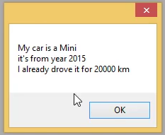

# Exercise: Data Types
1. Create a new class called **DataTypes**.  
2. Define a Run() method for that class.  
3. Define the following variables:
    1. string carName 
    1. int carYear
    1. int carKm
    1. char carGroup (set the value to be one of this options A, B or C).  
4. Display the values on a message box as below:  
  
5. Add a new menu entry named “Data Types”.  
6. Call this class to display the message box from the menu  
7. Build and test.  

Your **DataTypes** Class supposed to look like this code:
```csdiff
using System;
using System.Collections.Generic;
using System.Linq;
using System.Text;
using System.Threading.Tasks;

namespace Northwind.Exercises
{
    class DataTypes
    {
+       public void Run()
+       {
+           string carName = "Mini";
+           int carYear = 2015;
+           int CarKM = 20000;
+           char carGroup = 'A';
+           System.Windows.Forms.MessageBox.Show("My car is a " + carName +"\nit's from year "+carYear+"\nI already drove it for "+CarKM );
+       }
    }
}

```


---   
<iframe width="560" height="315" src="https://www.youtube.com/embed/_asGbeIkEgg?list=PL1DEQjXG2xnKI3TL-gsy91eXbh3ytOt6h" frameborder="0" allowfullscreen></iframe>