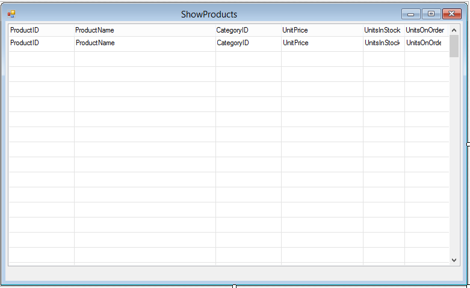

# Exercise - Creating a Simple Screen


1.	Under the “Exercises” folder, create a UIController named **ShowProducts**.
2.	Define the **Products** table at the beginning of the controller class.(drag and drop it, holding the **Shift** key just before the drop).
3.  In the **constructor** use the **From** to set the **Products** to be the class main table.
4.  Build the **Northwind** Project. (in the **Build**pule down menu, select **Build Northwind**).
1.	Using the **Class Outline** Open the Form Designer:  
    1.  Setup the Toolbox if you did not do that early, by right clicking on the form, select "Setup Toolbox".  
    1.  Add a grid with the following columns:  
        1.  ProductID
        1.  ProductName
        1.  CategoryID
        1.  UnitPrice
        1.  UnitsInStock
        1.  UnitsOnOrder
1.  Expand the form width to show the entire grid. 
1.	Add a new menu entry to call this screen.
1.	Build and test.

The **ShowProducts** class should look like :
```csdiff
using System;
using System.Collections.Generic;
using System.Text;
using System.Drawing;
using Firefly.Box;
using ENV;
using ENV.Data;

namespace Northwind.Exercises
{
    public class ShowProducts : UIControllerBase
    {

+       public readonly Models.Products Products = new Models.Products();

        public ShowProducts()
        {
+           From = Products;
        }

        public void Run()
        {
            Execute();
        }

        protected override void OnLoad()
        {
            View = () => new Views.ShowProductsView(this);
        }
    }
}
```
The **ShowProducts Form Designer** should look like :  



<iframe width="560" height="315" src="https://www.youtube.com/embed/PkikKDuWjLw?list=PL1DEQjXG2xnKwhPzEwuvVkEL7a_D9-pkL" frameborder="0" allowfullscreen></iframe>