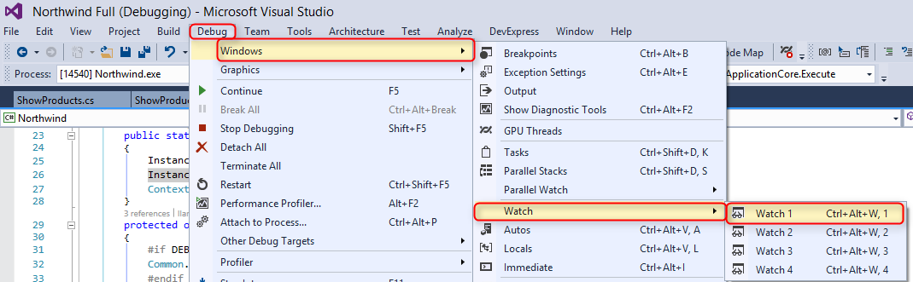

# Exercise - Using Debug Information

1. Run the application.
2. Run **ShowProducts**.
3. Use <kbd>Shift + F12</kbd> key combination to break into the code of **ShowProducts**.
4. Open the **Watch Window**.  

5. In the **Name** column of the **Watch Window** add the flowing items and examine the results in the **Value** column:  
    1. Activity
    2. From
    3. Where
    4. OrderBy
    5. Relations
    6. Columns

