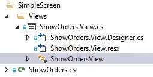
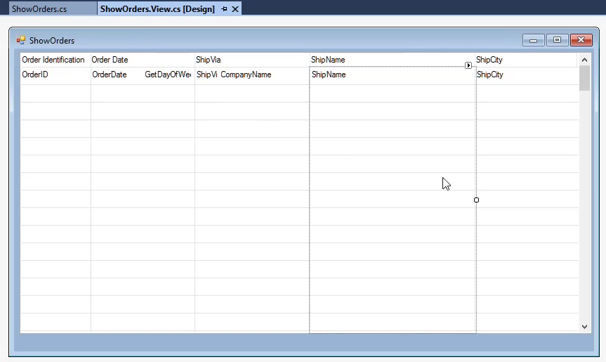

In this article we'll review controller and the view, their relationship and their roles.

### Review the different files used in the controller

* **ShowOrders.cs** -  The `ShowOrders` class. It is called the **Controller**. 
  * All our business logic and rules are written in this **Controller** file..
* **ShowOrders.view.cs** - the `ShowOrdersView` class. It is called the **View** and is in the "Views" namespace. Double click on it to get the "design view", where we can design our screen using drag and drop

#### The view is comprised by several "files"

* **ShowOrders.View.Designer.cs** - the code file where visual studio "stores" all the properties we have set in the "Design view". It is stored in C# code. This file is automatically generated and maintained by visual studio - you do not need to touch it's code.
  * Every time we change a property in the "Designer" a code line changes in this file.
* **ShowOrders.View.resx** - an internal file used by visual studio, to store resources we use in the "Design view" such as icons, localized strings etc... This file is automatically generated and maintained by visual studio - you do not need to touch it's code.
* **ShowOrdersView** - click on it to reach the "Code Behind" of the View.


### The "Code Behind" of the view
  * All the presentation logic - such as color expressions etc.. will be written in this file.
  * We can also reach this file from the "Design View" by right clicking on it and selecting "View Code"

```csdiff
partial class ShowOrdersView : Shared.Theme.Controls.Form
{
    ShowOrders _controller;
    public ShowOrdersView(ShowOrders controller)
    {
        _controller = controller;
        InitializeComponent();
    }
}
```
* It's constructor receives the **Controller** as a parameter and stores it in the `_controller` field. It'll  be used to access the **Controller** from the view.

In the `OnLoad` methid in the **Controller** class (ShowOrders.cs) we determine the **View**, and send in the controller to it, by using the `this` keyword when we call the `ShowOrdersView` constructor
```csdiff
protected override void OnLoad()
{
    View = () => new Views.ShowOrdersView(this);
}
```

<iframe width="560" height="315" src="https://www.youtube.com/embed/fUWjTZ5CRT8?list=PL1DEQjXG2xnKm36EZepT3dIiM5E8s5W0f" frameborder="0" allowfullscreen></iframe>


