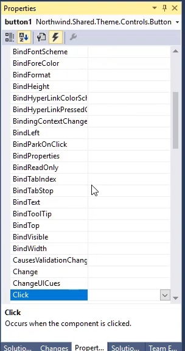

* Add a button to the form
* Show the Events Tab in the "Properties" window in Visual Studio

* Double click the `Click` event and show how Visual Studio generates the code that will be executed when the user clicks on the button.
* Show a message box when the user clicks on a button
* Use the `_controll` field to access the controller and extract the order id

```csdiff
private void button1_Click(object sender, ButtonClickEventArgs e)
{
+   MessageBox.Show("Order ID: " + _controller.Orders.OrderID);
}
```
<iframe width="560" height="315" src="https://www.youtube.com/embed/Qq7IIRpQrSs?list=PL1DEQjXG2xnKm36EZepT3dIiM5E8s5W0f" frameborder="0" allowfullscreen></iframe>