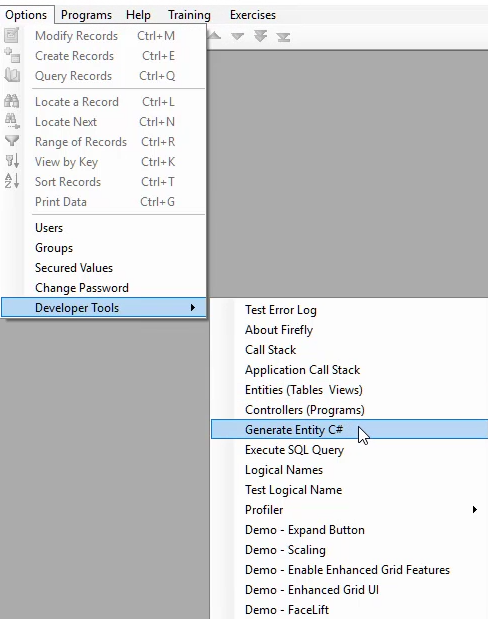

* Use the "Generate Entity C#" developer tool to create a table code class based on an existing database definition

<iframe width="560" height="315" src="https://www.youtube.com/embed/lNyeSG7FeEU?list=PL1DEQjXG2xnItyh3tX-1kfE3K50w48PNA" frameborder="0" allowfullscreen></iframe>

