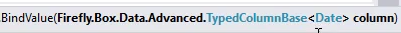

Keywords:TypedColumnBase,Init Expression
* We want the `ToDate` column to automatically change to the value of the `FromDate` column when ever the value of the `FromDate` column changes.
* To do that we'll bind the value of the `ToDate` column to the value of the `FromDate` column, using the `BindValue` method
* Review the first overload of the BindValue method

* Note  that it receives a parameter of type `TypedColumnBase<Date>` which means any `DateColumn`
```csdiff
public class DemoLocalColumns : UIControllerBase
{
    public readonly DateColumn FromDate = new DateColumn("From Date");
    public readonly DateColumn ToDate = new DateColumn("To Date");
    public DemoLocalColumns()
    {
+       ToDate.BindValue(FromDate);
    }
    public void Run()
    {
        Execute();
    }
    protected override void OnLoad()
    {
        View = () => new Views.DemoLocalColumnsView(this);
    }
}
```
* TypedColumnBase`<Date>` means a column of type `DateColumn`
* TypedColumnBase`<Time>` means a column of type `TimeColumn`
* TypedColumnBase`<Number>` means a column of type `NumberColumn`
* TypedColumnBase`<Bool>` means a column of type `BoolColumn`
* TypedColumnBase`<Text>` means a column of type `TextColumn`

See [TypedColumnBase Power Point Presentation](TypedColumnBase.pptx)

<iframe width="560" height="315" src="https://www.youtube.com/embed/mbekDWnVAq8?list=PL1DEQjXG2xnKHKNIRzI4K6oZL-KulU-Vw" frameborder="0" allowfullscreen></iframe>

For a deeper discussion of these topics see [Lambda Expressions Generics and BindValue](lambda-expressions-generics-and-bindvalue.html)