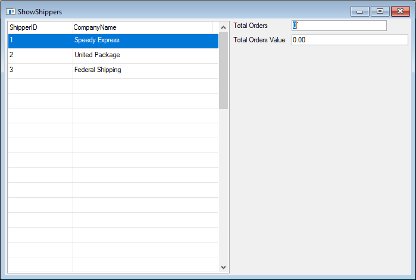

# Exercise - Filtering data in the BusinessProcess result

The **ShowShippers** class should look like :
```csdiff
using System;
using System.Collections.Generic;
using System.Text;
using System.Drawing;
using Firefly.Box;
using ENV;
using ENV.Data;

namespace Northwind.Exercises
{
    public class ShowShippers : UIControllerBase
    {

        public readonly Models.Shippers Shippers = new Models.Shippers();
        public readonly NumberColumn TotalOrders = new NumberColumn("Total Orders","6");
        public readonly NumberColumn TotalOrdersValue = new NumberColumn("Total Orders Value","6.2C");

        public ShowShippers()
        {
            From = Shippers;
        }

        public void Run()
        {
            Execute();
        }

        protected override void OnLoad()
        {
            View = () => new Views.ShowShippersView(this);
        }
    }
}
```
The run time version should look like :
