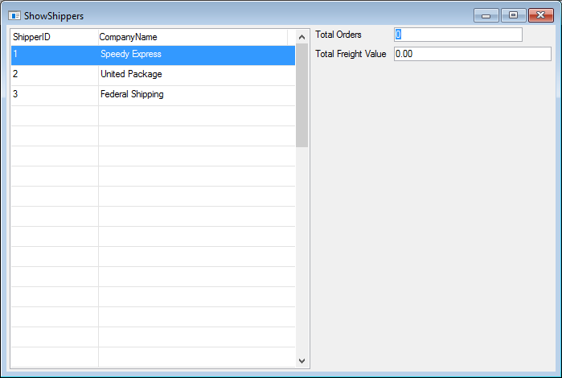

# Exercise - Filtering data in the BusinessProcess result

The **ShowShippers** class should look like :
```csdiff
using System;
using System.Collections.Generic;
using System.Text;
using System.Drawing;
using Firefly.Box;
using ENV;
using ENV.Data;

namespace Northwind.Exercises
{
    public class ShowShippers : UIControllerBase
    {

        public readonly Models.Shippers Shippers = new Models.Shippers();
        public readonly NumberColumn TotalOrders = new NumberColumn("Total Orders","6");
        public readonly NumberColumn TotalFreightValue = new NumberColumn("Total Freight Value", "6.2C");

        public ShowShippers()
        {
            From = Shippers;
        }

        public void Run()
        {
            Execute();
        }

        protected override void OnLoad()
        {
            View = () => new Views.ShowShippersView(this);
        }
    }
}
```
The run time version should look like :


The **CalcOrderTotalForShipper** class should look like :
```csdiff
using System;
using System.Collections.Generic;
using System.Text;
using System.Windows.Forms;
using Firefly.Box;
using ENV;
using ENV.Data;
using System.Diagnostics;

namespace Northwind.Exercises
{
    public class CalcOrderTotalForShipper : BusinessProcessBase
    {
        public readonly Models.Orders Orders = new Models.Orders();


        public CalcOrderTotalForShipper()
        {
            From = Orders;
        }
        public void Run(Number pShipperID)
        {
            Where.Add(Orders.ShipVia.IsEqualTo(pShipperID));
            Execute();
        }
        protected override void OnLeaveRow()
        {
            Debug.WriteLine("OrderID :" + Orders.OrderID + " Shipper ID :" + Orders.ShipVia);
        }
    }
}
```

The Output  panel results should look like :  

