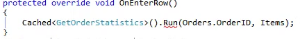
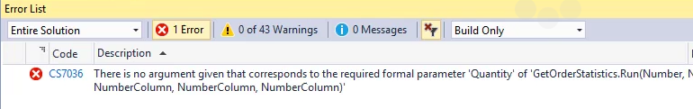

KeyWords:skip
* By default, any parameter is a mandatory parameter in C#.
* If we don't send a value into a parameter, Visual Studio will give us a Build error.
* This is the message we'll get when we don't send enough parameters:  


* To make a parameter optional, in it's definition instead of saying `(NumberColumn Count)` we say `(NumberColumn Count = null)`
```csdiff
+public void Run(Number OrderId,NumberColumn Count = null,NumberColumn Quantity = null, NumberColumn totalAmount = null)
{
    Where.Clear();
    Where.Add(Order_Details.OrderID.IsEqualTo(OrderId));
    _count = 0;
    _quantity = 0;
    _totalAmount = 0;
    Execute();
+   if (Count != null)
        Count.Value = _count;
+   if (Quantity != null)
        Quantity.Value = _quantity;
+   if (totalAmount != null)
        totalAmount.Value = _totalAmount;
}
```
* Optional parameters are displayed in the parameter information as surrounded by square brakes

* If we want to skip an optional parameter, we can use the `null` keyword to skip it when we are calling this method.
<iframe width="560" height="315" src="https://www.youtube.com/embed/DXkZjlMBXYU?list=PL1DEQjXG2xnKS0Zo7h-PrExXZ18hGxhvA" frameborder="0" allowfullscreen></iframe>

