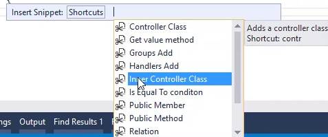

* Previously we created a separate BusinessProcess to collect the statistics of our order, now we'll use an inner class to achieve the same results
* An inner class is a class that is defined within the scope of it's container class.
* In the following code the class called `myInnerClass` is considered an inner class, since it is defined within the scope of it's container class `ShowOrdersToDemoInnerClasses` class
```csdiff
public class ShowOrdersToDemoInnerClasses : UIControllerBase
{
    public readonly Models.Orders Orders = new Models.Orders();
    public readonly NumberColumn Items = new NumberColumn("Items", "2");
    public readonly NumberColumn TotalQuantity = new NumberColumn("Total Quantity", "4");
    public readonly NumberColumn TotalAmount = new NumberColumn("Total Amount", "5C");
    public ShowOrdersToDemoInnerClasses()
    {
        From = Orders;
    }
    public void Run()
    {
        Execute();
    }
    protected override void OnLoad()
    {
        View = () => new Views.ShowOrdersToDemoInnerClassesView(this);
    }
+   class myInnerClass
+   {
+   }
}
```
* To quickly create an inner class, we'll use the "Inner Controller Class" snippet (`contr` in short)  

* Will determine:
  * The name of the inner class - in our case "GetTotals"
  * The base class - on our case `BusinessProcessBase` which is the default
  * The Container class - in our case `ShowOrdersToDemoInnerClasses`
* Here's the result
```csdiff
public class ShowOrdersToDemoInnerClasses : UIControllerBase
{
    public readonly Models.Orders Orders = new Models.Orders();
    public readonly NumberColumn Items = new NumberColumn("Items", "2");
    public readonly NumberColumn TotalQuantity = new NumberColumn("Total Quantity", "4");
    public readonly NumberColumn TotalAmount = new NumberColumn("Total Amount", "5C");
    public ShowOrdersToDemoInnerClasses()
    {
        From = Orders;
    }
    public void Run()
    {
        Execute();
    }
    protected override void OnLoad()
    {
        View = () => new Views.ShowOrdersToDemoInnerClassesView(this);
    }
+   class GetTotals : BusinessProcessBase
+   {
+       ShowOrdersToDemoInnerClasses _parent;
+       public GetTotals(ShowOrdersToDemoInnerClasses parent)
+       {
+           _parent = parent;
+       }
+       public void Run()
+       {
+           Execute();
+       }
+       protected override void OnLoad()
+       {
+       }
+   }
}
```
* Note that it's getting the parent controller as a parameter to it's constructor, and stores it in a field called `_parent` which we cal later use to access the parent controller.
* Here is how we call our inner controller
```csdiff
public class ShowOrdersToDemoInnerClasses : UIControllerBase
{
    public readonly Models.Orders Orders = new Models.Orders();
    public readonly NumberColumn Items = new NumberColumn("Items", "2");
    public readonly NumberColumn TotalQuantity = new NumberColumn("Total Quantity", "4");
    public readonly NumberColumn TotalAmount = new NumberColumn("Total Amount", "5C");
    public ShowOrdersToDemoInnerClasses()
    {
        From = Orders;
    }
    public void Run()
    {
        Execute();
    }
    protected override void OnLoad()
    {
        View = () => new Views.ShowOrdersToDemoInnerClassesView(this);
    }
+   protected override void OnEnterRow()
+   {
+       new GetTotals(this).Run();
+   }
    class GetTotals : BusinessProcessBase
    {
        ShowOrdersToDemoInnerClasses _parent;
        public GetTotals(ShowOrdersToDemoInnerClasses parent)
        {
            _parent = parent;
        }
        public void Run()
        {
            Execute();
        }
        protected override void OnLoad()
        {
        }
    }
}
```
* Note that when we call it, we are sending `this` as a parameter to it's constructor. This means that we are sending the parent controller as a parameter to the inner controller. Later we'll be able to use that `_parent` on our inner controller, to access fields in the `parent` controller.
<iframe width="560" height="315" src="https://www.youtube.com/embed/tmzHPxAyP7U?list=PL1DEQjXG2xnK8xPqBW89oPL6AHonic9Iz" frameborder="0" allowfullscreen></iframe>

