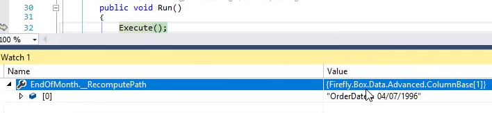
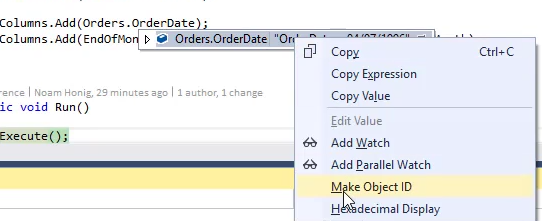
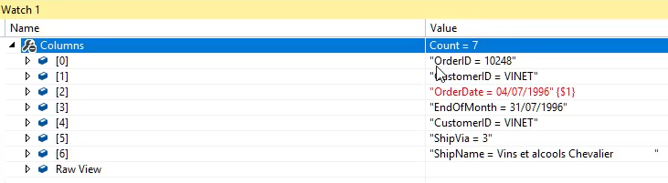

Keywords:__RecomputePath,Make Object ID
Let's review the columns collection and it's role in the Recompute

* Columns that are not added to the column collection will not participate in the recompute
### BindValue will only recompute based on columns that were added before it in the Columns Collection

* Add a local column EndOfMonth
```csdiff
    public class DemoColumnsCollection : UIControllerBase
    {
        public readonly Models.Orders Orders = new Models.Orders();
+       public readonly DateColumn EndOfMonth = new DateColumn("EndOfMonth");
        public DemoColumnsCollection()
        {
            From = Orders;

            Columns.Add(Orders.OrderID);
            Columns.Add(Orders.CustomerID);
            Columns.Add(Orders.OrderDate);
        }
        public void Run()
        {
            Execute();
        }
        protected override void OnLoad()
        {
            View = () => new Views.DemoColumnsCollectionView(this);
        }
    }
```
* ADd a BindValue for the `EndOfMonth` column
```csdiff
    public class DemoColumnsCollection : UIControllerBase
    {
        public readonly Models.Orders Orders = new Models.Orders();
+       public readonly DateColumn EndOfMonth = new DateColumn("EndOfMonth");
        public DemoColumnsCollection()
        {
            From = Orders;

            Columns.Add(Orders.OrderID);
            Columns.Add(Orders.CustomerID);
            Columns.Add(Orders.OrderDate);
+           Columns.Add(EndOfMonth).BindValue(() => Orders.OrderDate.EndOfMonth);
        }
        public void Run()
        {
            Execute();
        }
        protected override void OnLoad()
        {
            View = () => new Views.DemoColumnsCollectionView(this);
        }
    }
```
* Note that in the migrated code, the call to `BindValue` will be attached to the `Columns.Add` call for that column
* Note that if the `Columns.Add` of the `EndOfMonth` column is **after** the call to `Columns.Add` of the `Orders.OrderDate` column, the value of `EndOfMonth` will automatically change whenever the value of `Orders.OrderDate` changes
* Note that if the `Columns.Add` of the `EndOfMonth` column is **Before** the call to `Columns.Add` of the `Orders.OrderDate` column, the value of `EndOfMonth` will **NOT** automatically change whenever the value of `Orders.OrderDate` changes, it'll only evaluate once when you enter the row.
* We can use <kbd>Alt</kbd> + <kbd>up arrow</kbd> to move a line of code up, or <kbd>Alt</kbd> + <kbd>down arrow</kbd> to move a line of code down
### Debugging
* Break into the code using the <kbd>Control</kbd> + F12
* In the "Watch" window, use the `__RecomputePath` property of any column, to see the columns that when changed, will cause this column to recompute  

* You can also use the 'Make Object ID' right click option, to highlight columns (or any object) in the watch window and the columns collection, using the `{$1}` symbol.  
  



<iframe width="560" height="315" src="https://www.youtube.com/embed/nuXkncsdbfc?list=PL1DEQjXG2xnLhBFafjdkhUD_rDsiXiXHr" frameborder="0" allowfullscreen></iframe>

