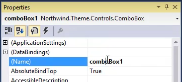
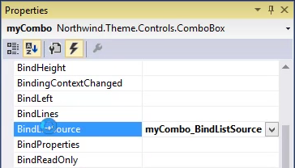

keywords:naming a control
In this article, we'll demo how to populate ListControls with data from the database. 
* We'll start by giving a meaningful name to our ComboBox. By default when you drag a ComboBox to the View it is given the name "comboBox1".
* That is the name that we'll use through out the code to refer to our ComboBox from code.
* We can change this name by changing the value of the Property called "(Name)" in the Properties Window  

* In our case, we'll use the name "myCombo". Note that when you change the value of this Property, Visual Studio will fix all the code that was referring to it.


### Binding to ListControl to Values from the Database
* We'll register to the `BindListSource` event, in the "events" tab of the Properties window  

* We'll declare the entity that we want to use and set it as the `ListSource`, we'll also determine the `ValueColumn` and the `DisplayColumn` which will be used for the data that is atcually displayed in the ComboBox
```csdiff
private void myCombo_BindListSource(object sender, EventArgs e)
{
+   var p = new Models.Products();
+   myCombo.ListSource = p;
+   myCombo.ValueColumn = p.ProductID;
+   myCombo.DisplayColumn = p.ProductName;
}
```
* We can also filter the values in the list by using the `ListWhere` property
```csdiff
private void myCombo_BindListSource(object sender, EventArgs e)
{
    var p = new Models.Products();
    myCombo.ListSource = p;
    myCombo.ValueColumn = p.ProductID;
    myCombo.DisplayColumn = p.ProductName;
+   myCombo.ListWhere.Add(p.CategoryID.IsEqualTo(1));
}
``` 
* We can Sort the list by using the `ListOrderBy` property, and assign it to an index from our Entiyu
```csdiff
private void myCombo_BindListSource(object sender, EventArgs e)
{
    var p = new Models.Products();
    myCombo.ListSource = p;
    myCombo.ValueColumn = p.ProductID;
    myCombo.DisplayColumn = p.ProductName;
    myCombo.ListWhere.Add(p.CategoryID.IsEqualTo(1));
+   myCombo.ListOrderBy = p.SortByProductName;
}
``` 
* Or we can use any custom sort we want:
```csdiff
private void myCombo_BindListSource(object sender, EventArgs e)
{
    var p = new Models.Products();
    myCombo.ListSource = p;
    myCombo.ValueColumn = p.ProductID;
    myCombo.DisplayColumn = p.ProductName;
    myCombo.ListWhere.Add(p.CategoryID.IsEqualTo(1));
-   myCombo.ListOrderBy = p.SortByProductName;
+   myCombo.ListOrderBy.Add(p.SortByProductName);
}
``` 

<iframe width="560" height="315" src="https://www.youtube.com/embed/iQhcbeo6Du0?list=PL1DEQjXG2xnIm0e_t85TXwY-Y9r19m-Mz" frameborder="0" allowfullscreen></iframe>

