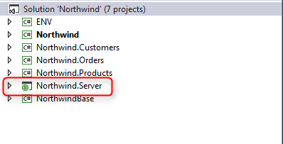
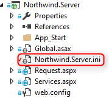
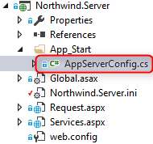
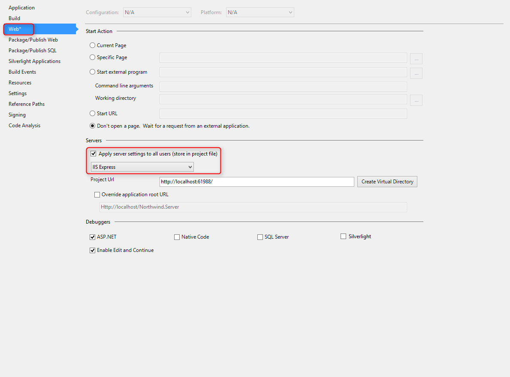

# Setup the Web templates configuration

1. Please make sure that Northwind.Server project is included in your solution.  
2. In Some cases you will need to run Visual studio as administrator, you will know that this is needed if the server project failed to load.  
3. For the solution to run as a web server please make sure that the server project is set as the "start up project".  




######  Members of the server:
1. The server ini file: controls the server project settings  


2. AppServerConfig : set up the environment variables and load the ini file  


######  Project Properties:
The server project properties can be access by right click on the project and select properties  
Make sure that you are in the Web section of the project properties  
You can select what IIS to use to test your project :  
* IIS Express, Visual Studio IIS.  
* Local IIS, the windows build in IIS.  
* External Host  

  


````

