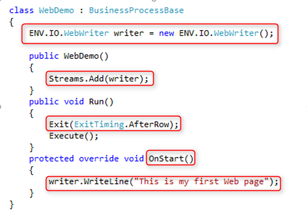

# The WebWriter

1. Just like the PrinterWriter we use to write our report to the printer, we will use the WebWriter to communicant our HTML replay to IIS and from there to the web browser.  
2. We start with a sort demo :  
   1. Please create a new BusinessProcess name it WebDemo.
   2. Setup a writer just before the class constructor using this line of code :  
      * ENV.IO.WebWriter writer = new ENV.IO.WebWriter();
   3. Add the new writer to the Streams collection :  
      * Streams.Add(writer);  
   4. Make sure that the BusinessProcess will stop after one cycle :  
      * Exit(ExitTiming.AfterRow);  
   5. Now let us write a replay to the writer :  
      1.  Override the OnStart  
      2.  Add this line of code :  
          * writer.WriteLine("This is my first Web Page");  


  

````

