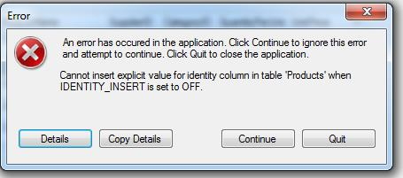
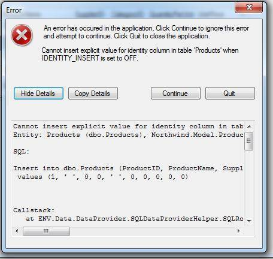


# Understanding Error Message Details

## Introduction

When an application encounters a runtime error, a message box is provided with an error details section specially designed to provide the user with the maximum amount of information in a clear format. This article explains how to view the various sections of the error details supplied by Firefly. Each section is then explained in detail.

## The Runtime Error Message Box

Runtime messages indicate an error based on logic or entered data, that occurs while the application is running. Let's use the example of trying to add a value to a field defined as a Primary Key with identity=true. Since the Database automatically provides a value for this field, shouldn't the user assign their own value, a runtime error will be generated and the following message box will be displayed:



Click 'Details' to see the displayed details for the error message:



Click 'Copy Details' to copy the error details to the clipboard.

# Error Messages Format

The following sections divide the error messages for the above example into their different sections, showing how the error details are formatted. Depending on the type of error, different sections may or may not appear.

## Heading

This is the title statement that explains the nature of the error. In our case, its clear that we were trying to create a duplicate record:
```
Cannot insert explicit value for identity column in table 'Products' when IDENTITY_INSERT is set to OFF.
Entity: Products (dbo.Products), Northwind.Model.Products
```

## SQL

This section shows the syntax of the SQL command that caused the problem, should there be one:
```
Insert into dbo.Products 
  (ProductID, ProductName, SupplierID, CategoryID, QuantityPerUnit, UnitPrice, 
  UnitsInStock, UnitsOnOrder,   ReorderLevel, Discontinued) 
  values (1, ' ', 0, 0, ' ', 0, 0, 0, 0, 0)
```

## Callstack

This section shows a detailed list of all code executed until the error was reached, including code that resides in ENV and Firefly.Box. This list is useful for low level analysis, when it is needed:

```
at ENV.Data.DataProvider.SQLDataProviderHelper.SQLRowsSource.Insert
   (IEnumerable`1 columns, IEnumerable`1 valuesV, IRowStorage storage) in    
   C:\temp\Dotnet\ENV\Data\DataProvider\SQLClient.cs:line 1549
at ENV.Data.DataProvider.DynamicSQLSupportingDataProvider.ActiveEntityMonitor.Insert(IEnumerable1
   columns, IEnumerable`1 values, IRowStorage storage) in  
   C:\temp\Dotnet\ENV\Data\DataProvider\DynamicSQLSupportingDataProvider.cs:line 143
at WizardOfOz.Witch.DataAccess.QueryClass.QuerySource.InnerRow.NewRowStrategy.InsertCommand.Run()
at Firefly.Box.Data.MonitoredDatabaseRunnerClass.RunQuery(RunMonitoredCommand command,
   Boolean isUpdateOrInsert)
```
## Application Callstack

This is a list of the programs called thus far.

For example:
```
Products
Main Program
```

## Short Callstack

The short Callstack is a very important section of the error information. This is where you would typically start looking, to see where the error in your code occurred. The short Callstack identifies the namespaces and the methods that are related to the error. If the compilation was made in Debug Mode, then the short Callstack will also include the filename in which the error occurred, as well as the line number where the error occurred.

The following lines show an example of the Short Callstack when compiled in Debug Mode. In the example, we see that the error occurred when executing ShowProducts at line 30, called beforehand from the Menu in ApplicationMDI at line 363:
```
at Northwind.DevDemo.ShowProducts.Run() in C:\temp\Dotnet\Northwind\DevDemo\ShowProducts.cs:line 30
at Northwind.UI.ApplicationMdi.showProductsToolStripMenuItem_Click(Object sender, EventArgs e)
  in C:\temp\Dotnet\Northwind\UI\ApplicationMdi.cs:line 363
at Northwind.Application.Execute() in C:\temp\Dotnet\Northwind\Application.cs:line 89
at Northwind.Application.Run() in C:\temp\Dotnet\Northwind\Application.cs:line 60
at Northwind.Program.Main(String[] args) in C:\temp\Dotnet\Northwind\Program.cs:line 41
```

## Memory Section

This last section displays general information regarding memory usage statistics at the time that the error occurred. For our example, this would appear as follows:
```
Memory Usage:
  Before GC Collect:
.Net Memory: 2
WorkingSet: 55
PeakWorkingSet: 56
PrivateMemorySize: 38
VirtualMemorySize: 240
Handles: 388
  After GC Collect:
.Net Memory: 1
WorkingSet: 55
PeakWorkingSet: 56
PrivateMemorySize: 38
VirtualMemorySize: 240
Handles: 388
 
 
Machine's Memory FIREFLY16: MemoryLoad: 38% 
  Available Physical: 4976 
  Available Virtual:  1807 
  Total Physical:     8109 
  Total Virtual:      2047
```

## Using a log file

The error messages can be sent to a log file which records all the above details of each error message in a log file as defined in the INI file as follows: GeneralErrorLog = c:\temp\mgerror.log

For more details regarding this and other log files, see: [Using Log Files](Using-Log-Files.html)