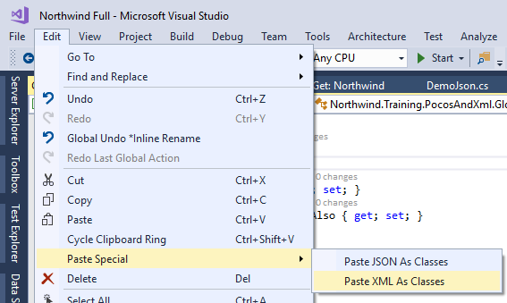

In many cases we have an XML file from an external source that we would like to use.

The easiest way to use it, is to create classes based on it and read them.

Just Copy the XML and choose the "Edit\Paste Special\Paste XML As Classes" and that's it.

<iframe width="560" height="315" src="https://www.youtube.com/embed/Ag1ZJl2RzJQ?list=PL1DEQjXG2xnIpyKeZmM66PL2bbuUyhyNE" frameborder="0" allowfullscreen></iframe>